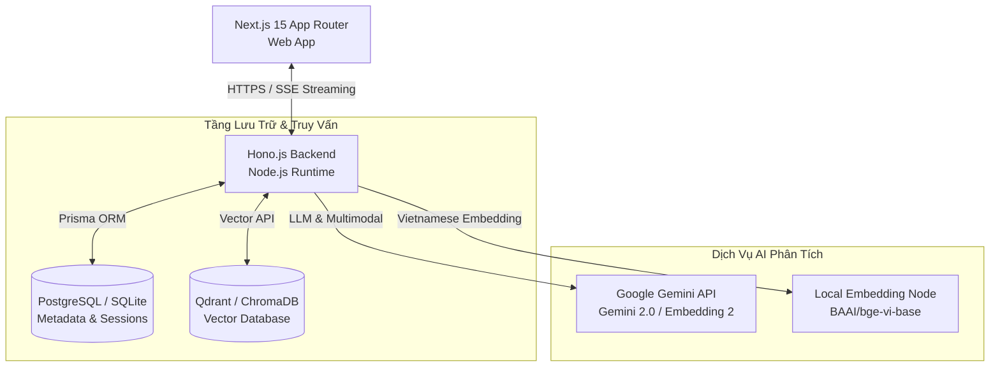

# HỆ THỐNG TRUY XUẤT KIẾN THỨC ĐA PHƯƠNG THỨC HỖ TRỢ HỌC TẬP (FPTU CHATBOT RAG)
## Đề Tài Nghiên Cứu Khoa Học & Ứng Dụng Thực Tiễn: So Sánh RAG và Fine-tuning trong Bối Cảnh Tiếng Việt

[](https://hono.dev)
[](https://nextjs.org)
[](https://prisma.io)
[](https://better-auth.com)

Chào mừng bạn đến với repository chính thức của dự án **FPTU Chatbot RAG**. Đây là hệ thống hỏi đáp thông minh dựa trên tri thức bài giảng đa phương thức, đồng thời là môi trường thực nghiệm để đánh giá, so sánh hiệu năng giữa phương pháp **Retrieval-Augmented Generation (RAG)** và **Fine-tuning** đối với kho tài liệu học tập tiếng Việt tại Đại học FPT.

---

## 🚀 Tính Năng Nổi Bật Hệ Thống

Hệ thống được thiết kế theo các tiêu chuẩn kỹ thuật hiện đại của năm 2026, cung cấp các tính năng vượt trội:

1. **Quản Lý Tài Liệu Đa Phương Thức (Multimodal Ingestion Pipeline):**
   * Hỗ trợ tải lên và trích xuất tài liệu từ nhiều định dạng: `.pdf`, `.docx`, `.txt`, `.pptx` (Slide bài giảng).
   * Hỗ trợ nhúng trực tiếp Video bài giảng (`.mp4`, `.mov`) và File âm thanh thông qua mô hình **Gemini Embedding 2** với khả năng tìm kiếm ngữ nghĩa đồng bộ.
2. **Chiến Lược Phân Đoạn Nâng Cao (Advanced Chunking Strategy):**
   * Sử dụng cơ chế kết hợp giữa **Document-based chunking** (chia theo Slide/trang bài học thực tế) và **Semantic chunking** để giữ trọn vẹn ngữ cảnh học thuật và cấu trúc logic của giáo trình.
3. **Giao Diện Trực Quan & Trích Dẫn Minh Bạch (Citation UI):**
   * Phản hồi dạng **Streaming (SSE)** thời gian thực với hiệu ứng gõ chữ mượt mà.
   * Hiển thị nguồn trích dẫn cụ thể (Slide số mấy, trang nào, giây thứ bao nhiêu trong video). Người dùng click vào nguồn sẽ được chuyển hướng trực tiếp đến trang PDF hoặc tua chính xác đến giây video tương ứng.
4. **Bảo Mật Cô Lập Đa Trường (Logical Multi-tenant Isolation):**
   * Kiến trúc Multi-tenant cho phép phân tách không gian tài liệu giữa các cơ sở đào tạo/trường học. Sinh viên trường A tuyệt đối không bị rò rỉ dữ liệu hoặc tìm chéo sang tài liệu trường B.
5. **Cơ Chế Kiểm Soát LLM (Knowledge Guardrails):**
   * Ngăn chặn hoàn toàn hiện tượng ảo tưởng (hallucination) của LLM bằng hệ thống Prompt chặt chẽ. Nếu câu hỏi nằm ngoài phạm vi tài liệu đã chỉ mục, chatbot sẽ lịch sự từ chối trả lời thay vì tự sáng tạo thông tin.

---

## 📊 Kết Quả Nghiên Cứu Thực Nghiệm (RAG vs Fine-tuning)

Hệ thống được tối ưu hóa dựa trên các nghiên cứu thực nghiệm chi tiết đối với ngôn ngữ tiếng Việt:

### 1. Đánh Giá Tổng Quan: RAG và Fine-tuning

| Tiêu Chí Đánh Giá | Retrieval-Augmented Generation (RAG) | Fine-tuning (Huấn Luyện Tinh Chỉnh) |
| :--- | :--- | :--- |
| **Độ chính xác dữ kiện** | **Vượt trội** (Truy xuất trực tiếp từ tài liệu gốc, triệt tiêu ảo tưởng) | **Trung bình** (Dễ bị hallucination nếu câu hỏi lệch cấu trúc dữ liệu train) |
| **Chi phí vận hành** | **Rất thấp** (Chỉ tốn phí API Embedding & lưu trữ Vector DB) | **Rất cao** (Cần hạ tầng GPU mạnh, chi phí train và cập nhật cực lớn) |
| **Khả năng cập nhật tri thức** | **Tức thời** (Chỉ cần cập nhật, thêm/xóa file trong Vector DB) | **Độ trễ cao** (Phải huấn luyện lại từ đầu mỗi khi có giáo trình mới) |
| **Khả năng kiểm chứng** | **Rõ ràng** (Có nguồn trích dẫn cụ thể: trang slide, giây video) | **Không có** (Câu trả lời sinh ra hoàn toàn từ trọng số mô hình) |

### 2. Chiến Lược Chunking Tối Ưu Cho Slide PDF Bài Giảng

* **Fixed-size Chunking (Kém nhất):** Cắt ngang bullet points, mất ý nghĩa ngữ cảnh giữa các trang slide.
* **Semantic & Document-based Chunking (Tối ưu nhất):** Chia tài liệu dựa trên cấu trúc các tiêu đề bài giảng (`Slide X: ...`), kết hợp phân đoạn ngữ nghĩa để giữ trọn ý nghĩa của từng bullet point.
* **Overlap Khuyến Nghị:** 50 - 100 tokens để duy trì tính liên kết thông tin giữa các slide kề nhau.

### 3. Đánh Giá Mô Hình Embedding Tiếng Việt (Vietnamese STS Benchmarks)

| Tên Mô Hình Embedding | Chỉ Số STS-Vi | MRR@10 (Retrieval) | Tốc độ xử lý (sent/s) | Khuyến Nghị Sử Dụng |
| :--- | :---: | :---: | :---: | :--- |
| **`BAAI/bge-vi-base`** | **0.88** | **0.84** | 950 | **Tối ưu nhất cho RAG tiếng Việt thô và slide** |
| `sBERT-Vi` | 0.86 | 0.81 | 1,100 | Phù hợp các chatbot hội thoại thông thường |
| `multilingual-e5-base` | 0.85 | 0.80 | 900 | Tốt cho hệ thống đa ngôn ngữ |
| `Gemini Embedding 2` | *N/A* | *High (Multimodal)* | API-dependent | **Bắt buộc cho RAG Đa phương thức (Video/Audio/Ảnh)** |

---

## 🏗️ Kiến Trúc Hệ Thống (System Architecture)



---

## 📂 Bản Đồ Thư Mục Monorepo

```
chatbot-rag-fptu/
├── api/                        # Mã nguồn Backend API (Hono.js + TypeScript)
│   ├── prisma/                 # Định nghĩa Schema dữ liệu quan hệ (Prisma)
│   └── src/                    # Logic xử lý API Gateway & RAG engine
├── database/                   # Cấu hình container PostgreSQL chạy Docker
├── docs/                       # Thư mục chứa tài liệu đặc tả & nghiên cứu chuyên sâu
│   ├── README.md               # Bản đồ tài liệu kỹ thuật
│   ├── system_requirements.md  # Đặc tả yêu cầu phần mềm (SRS)
│   ├── system_architecture.md  # Tài liệu thiết kế kiến trúc chi tiết
│   ├── folder_structure.md     # Định nghĩa cấu trúc thư mục toàn hệ thống
│   ├── development-roadmap.md  # Kế hoạch phát triển và lộ trình chi tiết
│   ├── code-standards.md       # Chuẩn viết code và quy ước phát triển
│   ├── hono_guide.md           # Hướng dẫn chi tiết phát triển Backend Hono.js
│   └── better_auth_guide.md    # Hẩm nang bảo mật xác thực Better Auth
├── web/                        # Giao diện người dùng Frontend (Next.js 15)
│   ├── app/                    # Các route giao diện chính (App Router)
│   └── components/             # Thư viện UI components tái sử dụng
└── Makefile                    # File cấu hình lệnh chạy nhanh của monorepo
```

---

## 🛠️ Hướng Dẫn Cài Đặt & Chạy Nhanh (Quick Start)

Dự án cung cấp tệp `Makefile` để đơn giản hóa tất cả các thao tác trên cả hai không gian làm việc.

### 1. Chuẩn Bị Môi Trường (.env)

> [!WARNING]
> Không bao giờ tạo các file `.env` cục bộ bên trong thư mục `api/` hoặc `web/`.
> Toàn bộ cấu hình hệ thống phải được lưu trữ duy nhất tại file `.env` ở **thư mục gốc (root)** của dự án. 

Sao chép file cấu hình mẫu và điền đầy đủ các khóa API cần thiết:
```bash
cp .env.example .env
```

### 2. Các Bước Khởi Chạy Nhanh

Thực hiện tuần tự các lệnh sau tại thư mục gốc:

1. **Khởi động database Docker:**
   ```bash
   make db-up
   ```
2. **Đồng bộ cơ sở dữ liệu và tạo Prisma Client:**
   ```bash
   make migrate
   make prisma-generate
   ```
3. **Chạy song song Backend và Frontend:**
   * Trong một terminal mới, chạy Backend API (cổng `3000`):
     ```bash
     make dev-api
     ```
   * Trong một terminal khác, chạy Frontend Web (cổng `3001`):
     ```bash
     make dev-web
     ```
4. **Kiểm tra trạng thái hoạt động (Health check):**
   ```bash
   make health-check
   ```

Để biết thêm chi tiết về tất cả lệnh CLI khả dụng, vui lòng tham khảo [CLAUDE.md](file:///E:/FPT/Semester_7/SWD392/chatbot-rag-fptu/CLAUDE.md).

---

## 📄 Tài Liệu Tham Khảo Dành Cho Nhà Phát Triển
* **Lộ trình chi tiết:** Xem [Lộ trình phát triển hệ thống (development-roadmap.md)](file:///e:/FPT/Semester_7/SWD392/chatbot-rag-fptu/docs/development-roadmap.md).
* **Quy chuẩn lập trình:** Xem [Bộ quy chuẩn code tiêu chuẩn (code-standards.md)](file:///e:/FPT/Semester_7/SWD392/chatbot-rag-fptu/docs/code-standards.md).
* **Chi tiết Kiến trúc:** Xem [Đặc tả kỹ thuật (system_architecture.md)](file:///e:/FPT/Semester_7/SWD392/chatbot-rag-fptu/docs/system_architecture.md).
