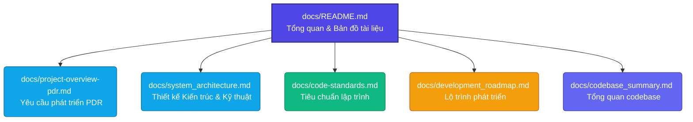

# HỆ THỐNG CHATBOT RAG HỖ TRỢ HỌC TẬP FPTU
## HỆ THỐNG TRUY XUẤT KIẾN THỨC ĐA PHƯƠNG THỨC HỖ TRỢ HỌC TẬP

Chào mừng bạn đến với thư mục tài liệu kỹ thuật của dự án **Chatbot RAG FPTU**. Dự án này được phát triển nhằm giải quyết nhu cầu tra cứu và hỏi đáp tài liệu môn học của sinh viên FPT University bằng phương pháp tối ưu hóa LLM phổ biến hiện nay: **Retrieval-Augmented Generation (RAG)** trong ngữ cảnh xử lý tiếng Việt.

---

## Tổng Quan Dự Án

### Ý tưởng & Bối cảnh (Context)
* **Tên dự án:** *Xây dựng chatbot cho phép sinh viên hỏi đáp dựa trên tài liệu môn học (FPTU Chatbot RAG).*
* **Mục tiêu cốt lõi:**
  * **Hệ thống thực tế:** Xây dựng một ứng dụng web RAG đa phương thức (hỗ trợ Text, PDF, Slide, Video, Image) cho phép giảng viên/nhà trường tải lên tài liệu học tập (Syllabus, Slide bài giảng, Video bài giảng) và cho phép sinh viên trò chuyện, hỏi đáp dựa trên chính nguồn tài liệu đó.
* **Đối tượng phục vụ:** Sinh viên, giảng viên và các trường đại học (hỗ trợ mô hình đa trường học - multi-tenant).

---

## Tech Stack Hiện Tại

| Layer | Technology | Version |
|-------|------------|---------|
| Backend API | Hono.js | 4.12.19 |
| Language | TypeScript | 5.8.3 |
| ORM | Prisma | 5.18.0 |
| Auth | Better Auth | 1.6.11 |
| Frontend | Next.js | 16.2.6 |
| UI Library | React | 19.2.4 |
| Styling | Tailwind CSS | 4 |
| State | TanStack Query | latest |
| Vector DB | Qdrant | latest |
| Embedding | Gemini 2.0 (embedding-002) | 3072-dim |
| LLM | Gemini 2.0 (streaming) | latest |
| Database | PostgreSQL | latest |
| Cache | Redis | latest |

---

## Bản Đồ Tài Liệu (Documentation Map)

### Chuyên đề phát triển hệ thống
1. **[Tài liệu Yêu cầu Phát triển (PDR)](./project-overview-pdr.md)**
   * Định nghĩa các tác nhân (Actors) và mô hình phân quyền (Student, Lecturer, Admin).
   * Chi tiết các tính năng chính: Quản lý tài liệu đa phương thức, Chat & Hỏi đáp thông minh, Dẫn nguồn trích dẫn.
   * Yêu cầu phi chức năng: Tính mở rộng (Scalability), Bảo mật, Hiệu năng truy vấn.
2. **[Thiết kế Kiến trúc & Kỹ thuật](./system_architecture.md)**
   * Sơ đồ luồng dữ liệu (Data Flow) tổng thể từ khi tải tài liệu đến khi trả lời.
   * Chi tiết Tech-stack và API Endpoints.
   * Pipeline xử lý Multimodal.
3. **[Tiêu chuẩn lập trình](./code-standards.md)**
   * Quy chuẩn TypeScript & Clean Code.
   * Quy chuẩn Backend Hono.js.
   * Quy chuẩn Frontend Next.js.
   * Nguyên tắc bảo mật Multi-tenant Isolation Guardrails.
4. **[Lộ trình phát triển](./development-roadmap.md)**
   * Các giai đoạn phát triển và tiến độ hiện tại.
   * Milestones và success criteria.
5. **[Tổng quan codebase](./codebase-summary.md)**
   * Thống kê source files và LOC.
   * Module breakdown chi tiết.

---

## Sản Phẩm Bàn Giao (Deliverables)

| STT | Sản phẩm bàn giao | Mô tả chi tiết | Trạng thái |
|:---:|---|---|:---:|
| **1** | **Web App Chatbot** | Hệ thống web hoàn chỉnh với giao diện đẹp mắt, Responsive, hỗ trợ chế độ Sáng/Tối. Tích hợp RAG đa phương thức và trang quản trị quản lý tài liệu học tập theo khóa học/chương học. | *Đang phát triển* |
| **2** | **Source Code GitHub** | Mã nguồn sạch, cấu trúc rõ ràng: thư mục `web/` (Next.js) và `api/` (Hono.js). Đi kèm file `README.md` hướng dẫn deploy chi tiết. | *Đã khởi tạo* |
| **3** | **Tài liệu Kỹ thuật** | Tập tài liệu đặc tả PDR, Thiết kế Kiến trúc và Hướng dẫn vận hành hệ thống RAG Chatbot hoàn chỉnh. | *Đang biên soạn* |

---

> [!NOTE]
> Hệ thống được thiết kế hướng tới khả năng **Scale đa trường** (Multi-tenant) và hỗ trợ **Multimodal Embedding Native** thông qua Gemini Embedding 2, cho phép nhúng trực tiếp Video/Audio vào cùng không gian vector với văn bản mà không cần chia nhỏ thủ công thành ảnh.