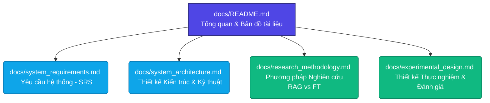

# HỆ THỐNG CHATBOT RAG HỖ TRỢ HỌC TẬP FPTU
## NGHIÊN CỨU & SO SÁNH HIỆU QUẢ GIỮA RAG VÀ FINE-TUNING TRONG BỐI CẢNH TIẾNG VIỆT

Chào mừng bạn đến với thư mục tài liệu kỹ thuật và nghiên cứu của dự án **Chatbot RAG FPTU**. Dự án này được phát triển nhằm giải quyết nhu cầu tra cứu và hỏi đáp tài liệu môn học của sinh viên FPT University, đồng thời thực hiện nghiên cứu học thuật thực nghiệm để so sánh hai phương pháp tối ưu hóa LLM phổ biến hiện nay: **Retrieval-Augmented Generation (RAG)** và **Fine-tuning** trong ngữ cảnh xử lý tiếng Việt.

---

## 📌 Tổng Quan Dự Án & Đề Tài Nghiên Cứu

### 1. Ý tưởng & Bối cảnh (Context)
* **Tên đề tài:** *"Xây dựng chatbot cho phép sinh viên hỏi đáp dựa trên tài liệu môn học, đồng thời nghiên cứu và so sánh hiệu quả giữa RAG và fine-tuning trong bối cảnh tiếng Việt."*
* **Mục tiêu cốt lõi:** 
  1. **Hệ thống thực tế:** Xây dựng một ứng dụng web RAG đa phương thức (hỗ trợ Text, PDF, Slide, Video, Image) cho phép giảng viên/nhà trường tải lên tài liệu học tập (Syllabus, Slide bài giảng, Video bài giảng) và cho phép sinh viên trò chuyện, hỏi đáp dựa trên chính nguồn tài liệu đó.
  2. **Nghiên cứu học thuật:** So sánh thực nghiệm một cách khoa học để đánh giá xem phương pháp nào (RAG hay Fine-tuning) mang lại độ chính xác cao hơn, chi phí vận hành tối ưu hơn và khả năng cập nhật tri thức tốt hơn cho tiếng Việt.
* **Đối tượng phục vụ:** Sinh viên, giảng viên và các trường đại học (hỗ trợ mô hình đa trường học - multi-tenant).

---

## 🗺️ Bản Đồ Tài Liệu (Documentation Map)

Để thuận tiện cho việc nghiên cứu và phát triển, tài liệu được phân chia thành 5 chuyên đề chi tiết sau:

### Chuyên đề phát triển hệ thống
1. **[Tài liệu Yêu cầu Hệ thống (SRS)](file:///e:/FPT/Semester_7/SWD392/chatbot-rag-fptu/docs/system_requirements.md)**
   * Định nghĩa các tác nhân (Actors) và mô hình phân quyền (Student, Lecturer, Admin).
   * Chi tiết các tính năng chính: Quản lý tài liệu đa phương thức (PDF, DOCX, Slide, Video, Image), Chat & Hỏi đáp thông minh, Dẫn nguồn trích dẫn, Giới hạn phạm vi tri thức.
   * Yêu cầu phi chức năng: Tính mở rộng (Scalability), Bảo mật, Hiệu năng truy vấn.
2. **[Thiết kế Kiến trúc & Kỹ thuật (Technical Architecture)](file:///e:/FPT/Semester_7/SWD392/chatbot-rag-fptu/docs/system_architecture.md)**
   * Sơ đồ luồng dữ liệu (Data Flow) tổng thể từ khi tải tài liệu đến khi trả lời.
   * Chi tiết Tech-stack: **Next.js** (Frontend), **Hono.js + TypeScript** (Backend), **Vector Database** (Qdrant/Chroma), và các LLM API (Gemini, Claude, GPT-4o).
   * Đặc tả API Hono và Cấu trúc cơ sở dữ liệu.
   * Pipeline xử lý Multimodal (xử lý Video & Audio bằng Gemini Embedding 2).

### Chuyên đề nghiên cứu & thực nghiệm
3. **[Phương pháp Nghiên cứu So sánh RAG vs Fine-tuning](file:///e:/FPT/Semester_7/SWD392/chatbot-rag-fptu/docs/research_methodology.md)**
   * Khung lý thuyết & Bảng so sánh 3 tiêu chí cốt lõi: Độ chính xác, Chi phí, Khả năng cập nhật.
   * Các chiến lược Chunking tối ưu cho Slide PDF (Fixed-size, Semantic, Hierarchical).
   * Đánh giá chi tiết các Embedding models hỗ trợ tiếng Việt (bge-vi-base, multilingual-e5, PhoBERT).
4. **[Thiết kế Thực nghiệm & Đánh giá (Experimental Setup & Evaluation)](file:///e:/FPT/Semester_7/SWD392/chatbot-rag-fptu/docs/experimental_design.md)**
   * Quy trình xây dựng **Test set gồm 50 câu hỏi kèm Ground Truth** được kiểm duyệt bởi con người.
   * Các chỉ số đánh giá khoa học: RAGAS Framework (Faithfulness, Answer Relevance, Context Recall, Context Precision), MRR@10, Latency, Cost.
   * Kịch bản thực nghiệm từng pha để đưa ra kết luận cho luận văn/đồ án.

---

## 📦 Sản Phẩm Bàn Giao (Deliverables)

Dự án cam kết bàn giao đầy đủ các cấu phần sau:

| STT | Sản phẩm bàn giao | Mô tả chi tiết | Trạng thái |
|:---:|---|---|:---:|
| **1** | **Web App Chatbot** | Hệ thống web hoàn chỉnh với giao diện đẹp mắt, Responsive, hỗ trợ chế độ Sáng/Tối. Tích hợp RAG đa phương thức và trang quản trị quản lý tài liệu học tập theo khóa học/chương học. | *Đang phát triển* |
| **2** | **Source Code GitHub** | Mã nguồn sạch, cấu trúc rõ ràng: thư mục `web/` (Next.js) và `api/` (Hono.js). Đi kèm file `README.md` hướng dẫn deploy chi tiết. | *Đã khởi tạo* |
| **3** | **Test Set 50 Q&A** | Tập dữ liệu 50 câu hỏi trắc nghiệm/tự luận thực tế từ tài liệu môn học FPT kèm câu trả lời chuẩn (Ground Truth) do con người chuẩn bị để làm cơ sở đối chuẩn (evaluation baseline). | *Đang chuẩn bị* |
| **4** | **Báo cáo Khoa học** | Tập tài liệu nghiên cứu so sánh RAG vs Fine-Tuning hoàn chỉnh dưới dạng PDF/Markdown phục vụ báo cáo đồ án SWD392 và khóa luận tốt nghiệp. | *Đang biên soạn* |

---

> [!NOTE]
> Hệ thống được thiết kế hướng tới khả năng **Scale đa trường** (Multi-tenant) và hỗ trợ **Multimodal Embedding Native** thông qua Gemini Embedding 2, cho phép nhúng trực tiếp Video/Audio vào cùng không gian vector với văn bản mà không cần chia nhỏ thủ công thành ảnh.
