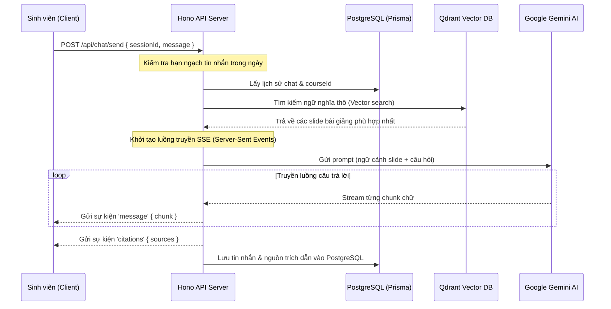
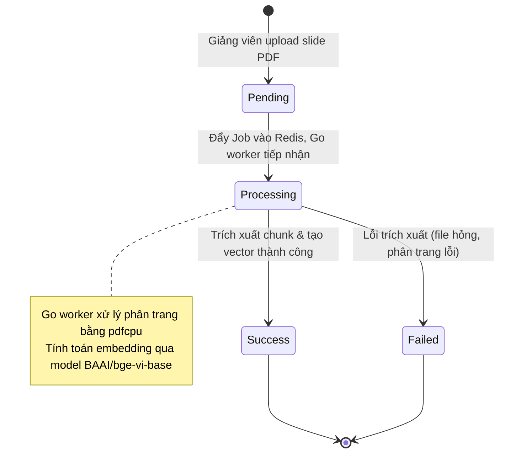

# API Documentation - Writing Guidelines (Chatbot RAG FPTU)

Quy chuẩn và hướng dẫn cách viết tài liệu đặc tả API rõ ràng, nhất quán và chuyên nghiệp cho dự án Chatbot RAG FPTU.

---

## 🇻🇳 Quy Tắc Ngôn Ngữ (Language Rules)

### 1. Ngôn Ngữ Chủ Đạo: Tiếng Việt
- Sử dụng Tiếng Việt cho toàn bộ mô tả, giải thích nghiệp vụ, gợi ý và lưu ý.
- Giữ nguyên các thuật ngữ kỹ thuật Tiếng Anh phổ biến để đảm bảo tính tự nhiên (ví dụ: *endpoint, request, response, payload, stream, session, cookie, webhook*).

### 2. Bảng Đối Chiếu Thuật Ngữ (Glossary)

| Thuật ngữ Tiếng Anh | Bản dịch / Cách dùng Tiếng Việt |
| :--- | :--- |
| **endpoint** | endpoint (giữ nguyên) |
| **ingestion / indexing** | nạp tài liệu / lập chỉ mục |
| **retrieval** | truy xuất dữ liệu |
| **stream / streaming** | truyền luồng / dạng stream |
| **authentication** | xác thực |
| **authorization** | phân quyền |
| **payload** | payload / dữ liệu gửi lên |
| **citations** | nguồn trích dẫn |

---

## 📊 Biểu Mẫu Sơ Đồ (Diagram Guidelines)

Sử dụng **Mermaid.js** để trực quan hóa các luồng dữ liệu phức tạp của hệ thống.

### Sơ đồ luồng xử lý RAG Chat Streaming (Sequence Diagram Template)



### Sơ đồ luồng trạng thái Ingestion tài liệu (State Diagram Template)



---

## 🛠️ Quy Chuẩn Định Dạng (Formatting Rules)

### 1. Code Blocks
Luôn khai báo rõ ngôn ngữ lập trình cho code block để kích hoạt syntax highlighting:
- `json` cho dữ liệu Request/Response.
- `bash` cho các câu lệnh cURL kiểm thử.
- `typescript` cho các đoạn code ví dụ tích hợp phía Client (Next.js/React).

### 2. Biểu thị Bắt buộc / Tùy chọn trong bảng biểu
- Sử dụng tick xanh **✅** để biểu thị tham số/trường bắt buộc.
- Sử dụng chéo đỏ **❌** để biểu thị tham số/trường tùy chọn.

### 3. Cấu Trúc Trình Bày Endpoint Chuẩn
Mỗi endpoint trong tài liệu đặc tả chi tiết phải tuân theo cấu trúc phân cấp sau:

```markdown
### {STT}. {Tên hành động} ({GET/POST/PATCH/DELETE} {Đường dẫn})

- **Mô tả:** {Giải thích nghiệp vụ bằng Tiếng Việt}
- **Xác thực:** {Loại xác thực: Better Auth Cookie, Worker Bearer Token, or Không cần}
- **Tham số Đường Dẫn (Path Parameters):** {Bảng mô tả nếu có}
- **Request Body (JSON):** {Bảng mô tả các trường và ví dụ JSON gửi lên}
- **Mã phản hồi (Response):** {Ví dụ JSON thành công và lỗi kèm HTTP Status}
```

---

## 🔗 Liên kết Hữu ích trong hướng dẫn
- **[File Templates](./file-templates.md)** - Biểu mẫu chi tiết mẫu của các file tài liệu.
- **[Quality Checklist](./quality-checklist.md)** - Bảng tiêu chuẩn kiểm soát chất lượng.
- **[Agent Instructions](./agent-instructions.md)** - Chỉ dẫn quy trình phân tích mã nguồn cho AI Agent.
