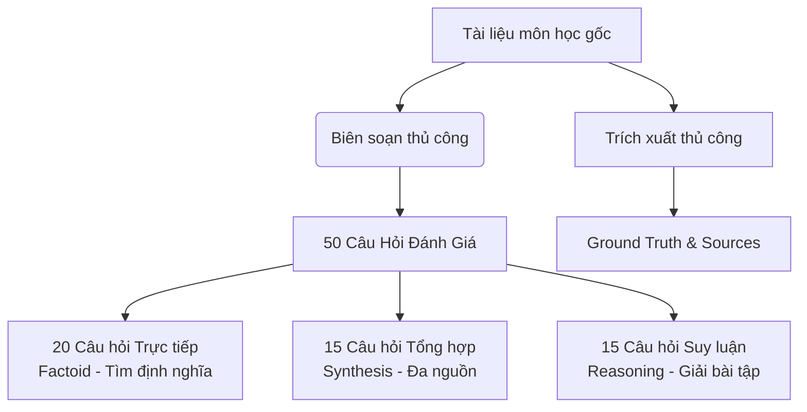
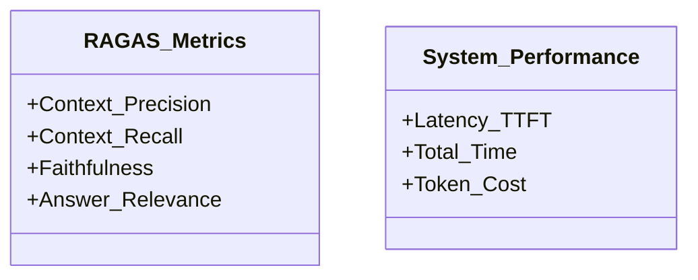

# THIẾT KẾ THỰC NGHIỆM & ĐÁNH GIÁ (EXPERIMENTAL SETUP & EVALUATION)

Tài liệu này hướng dẫn cách thiết lập thực nghiệm khoa học, xây dựng tập dữ liệu đối chuẩn (Test Set) và áp dụng các khung đánh giá tiêu chuẩn như **Ragas Framework** để so sánh định lượng hiệu quả của RAG và Fine-tuning trên thực tế.

---

## 1. Xây Dựng Tập Dữ Liệu Đối Chuẩn (Test Set & Ground Truth)

Để đánh giá chatbot một cách khách quan, dự án xây dựng một **Test Set gồm 50 câu hỏi** chất lượng cao dựa trên tài liệu môn học demo, đi kèm với câu trả lời chuẩn (Ground Truth) do con người (giảng viên/sinh viên giỏi) soạn thảo.

### Phân loại cấu trúc 50 câu hỏi trong Test Set:
* **20 câu hỏi Trực tiếp (Factoid Questions):**
  * *Mô tả:* Các câu hỏi tra cứu định nghĩa, công thức hoặc con số cụ thể nằm trọn trong một slide.
  * *Ví dụ:* *"Độ phức tạp thời gian trung bình của thuật toán Quicksort là bao nhiêu?"*
* **15 câu hỏi Tổng hợp (Synthesis Questions):**
  * *Mô tả:* Đòi hỏi hệ thống phải truy xuất thông tin từ 2 slide hoặc 2 chương khác nhau để tổng hợp lại câu trả lời đầy đủ.
  * *Ví dụ:* *"Hãy so sánh sự khác biệt giữa thuật toán Quicksort và Mergesort về bộ nhớ phụ trợ (auxiliary space) được trình bày trong chương 1 và chương 3?"*
* **15 câu hỏi Suy luận & Áp dụng (Reasoning Questions):**
  * *Mô tả:* Yêu cầu giải thích nguyên lý hoạt động, tại sao nên dùng hoặc áp dụng lý thuyết để giải một bài toán nhỏ.
  * *Ví dụ:* *"Trong trường hợp mảng đã được sắp xếp tăng dần, tại sao Quicksort với cách chọn pivot là phần tử cuối cùng lại bị suy biến thành O(n^2)?"*

---

## 2. Chỉ Số Đánh Giá (Evaluation Metrics)

Hệ thống RAG được đánh giá thông qua hai thành phần độc lập: **Khả năng Truy xuất (Retrieval)** và **Khả năng Sinh văn bản (Generation)** bằng cách sử dụng **Ragas Framework** kết hợp với các chỉ số hiệu năng thực tế.

### 2.1 Đánh giá Khả năng Truy xuất (Retrieval Metrics)
* **Context Recall (Độ bao phủ ngữ cảnh):**
  * *Mô tả:* Đo lường xem hệ thống có truy xuất được đầy đủ tất cả các thông tin cần thiết từ tài liệu gốc (Ground Truth) để trả lời câu hỏi không.
  * *Công thức:* Tỷ lệ các dữ kiện trong Ground Truth xuất hiện trong các chunks được truy xuất.
* **Context Precision (Độ chính xác ngữ cảnh):**
  * *Mô tả:* Đánh giá xem các chunks được truy xuất có thực sự liên quan đến câu hỏi hay không và các chunk chứa thông tin đúng có được Vector DB xếp hạng cao lên đầu hay không.

### 2.2 Đánh giá Khả năng Sinh câu trả lời (Generation Metrics)
* **Faithfulness (Độ trung thực - Tránh Ảo tưởng):**
  * *Mô tả:* Đo lường xem câu trả lời của chatbot có hoàn toàn dựa trên ngữ cảnh được truy xuất hay không. Nếu chatbot tự "bịa" ra thông tin không có trong context, điểm Faithfulness sẽ thấp.
* **Answer Relevance (Độ liên quan câu trả lời):**
  * *Mô tả:* Đánh giá mức độ tập trung và trả lời đúng trọng tâm câu hỏi của sinh viên (không trả lời lan man hoặc lạc đề).

### 2.3 Chỉ số Hiệu năng Hệ thống (Operational Metrics)
* **Latency (Thời gian phản hồi):**
  * **Time to First Token (TTFT):** Thời gian từ lúc sinh viên nhấn gửi đến khi chữ đầu tiên xuất hiện (Mục tiêu: $< 800\text{ms}$).
  * **Total Latency:** Tổng thời gian hoàn thành câu trả lời (Mục tiêu: $< 3\text{s}$).
* **Cost (Chi phí):** Tính toán số lượng token trung bình tiêu thụ trên mỗi câu hỏi (gồm cả token tìm kiếm ngữ cảnh) để quy đổi ra chi phí tài chính thực tế.

---

## 3. Kịch Bản Thực Nghiệm So Sánh (Experimental Scenarios)

Nghiên cứu sẽ chạy 3 kịch bản thực nghiệm để thu thập dữ liệu viết báo cáo:

### 💡 Kịch bản 1: So sánh các chiến lược Chunking & Embedding tiếng Việt
* Chạy test set 50 câu hỏi trên cùng một LLM (e.g. GPT-4o-mini) nhưng thay đổi cấu hình RAG:
  * **Cấu hình A:** Fixed-size chunking (500 ký tự) + `multilingual-e5-base`.
  * **Cấu hình B:** Document-based chunking (theo Slide) + `BAAI/bge-vi-base` (Đề xuất tối ưu).
* *Kết quả kỳ vọng:* Cấu hình B đạt chỉ số **Context Recall** và **Context Precision** cao hơn tối thiểu 15% so với cấu hình A.

### 💡 Kịch bản 2: So sánh RAG vs Fine-tuning thuần túy
* **Hệ thống RAG (Cấu hình B ở trên):** Không train lại mô hình, chỉ truy xuất vector.
* **Hệ thống Fine-tuned:** Huấn luyện một mô hình ngôn ngữ nhỏ (ví dụ: LLaMA-3-8B hoặc PhoGPT) bằng tập dữ liệu Q&A chuẩn soạn từ tài liệu học tập (không dùng RAG khi inference).
* *Kết quả đánh giá:*
  * Đánh giá độ chính xác dữ kiện thô (Factoid Accuracy).
  * Đánh giá tỷ lệ ảo tưởng (Hallucination Rate).
  * Đánh giá khả năng cập nhật tri thức khi thay đổi một số dữ kiện trong tài liệu bài giảng (ví dụ thay đổi ngày thi, phiên bản công nghệ).

### 💡 Kịch bản 3: So sánh Chi phí & Tốc độ vận hành
* Thu thập dữ liệu thực tế về tài nguyên GPU tiêu thụ khi huấn luyện Fine-tuning vs Chi phí gọi API của RAG.
* Đánh giá mức độ phức tạp khi bảo trì hệ thống khi giáo trình của trường được cập nhật.

---

## 4. Tiến Trình Thực Hiện Đề Tài (Project Timeline & Milestones)

Dự án được phân chia thành các cột mốc tuần tự nhằm đảm bảo chất lượng khoa học và kỹ thuật:

| Tuần học | Nội dung công việc | Sản phẩm đầu ra | Trạng thái |
|:---:|---|---|:---:|
| **Tuần 1 - 2** | Nghiên cứu tài liệu, xác định Research Questions và thiết kế kiến trúc hệ thống Next.js + Hono.js. | Tài liệu SRS, Tài liệu Thiết kế Kiến trúc. | **Đã hoàn thành** |
| **Tuần 3 - 4** | Phát triển Ingestion Engine xử lý tài liệu (PDF, Slide, Video) và Vector DB (Chroma/Qdrant). | Mã nguồn API Hono xử lý File & Embed. | *Đang thực hiện* |
| **Tuần 5 - 6** | Xây dựng giao diện Chatbot Next.js hỗ trợ Streaming (SSE) và hiển thị Citation đồng bộ. | Giao diện Web hoàn chỉnh, mượt mà. | *Đang thực hiện* |
| **Tuần 7** | Xây dựng Test Set 50 câu hỏi chuẩn hóa kèm Ground Truth từ môn học demo. | File test_set.json. | *Chưa bắt đầu* |
| **Tuần 8 - 9** | Chạy thực nghiệm Ragas Framework, đánh giá các kịch bản so sánh RAG vs Fine-tuning. | Tập số liệu thực nghiệm, biểu đồ so sánh. | *Chưa bắt đầu* |
| **Tuần 10** | Viết báo cáo đồ án SWD392/Khóa luận tốt nghiệp và chuẩn bị slide thuyết trình demo. | Báo cáo hoàn chỉnh & Slide Demo. | *Chưa bắt đầu* |
