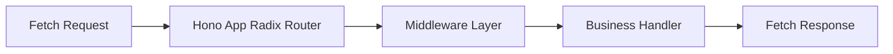
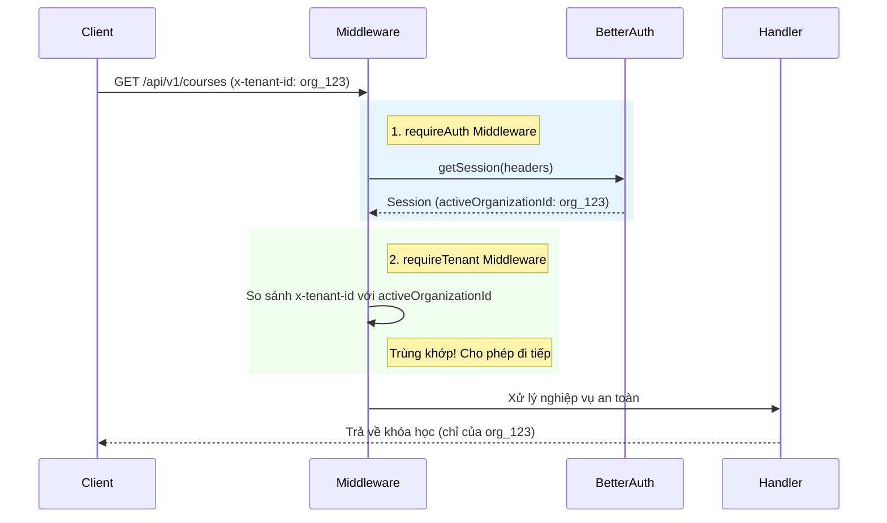

# Cẩm Nang Toàn Diện Về Hono.js Cho Developer

Tài liệu này là nguồn dữ liệu chuẩn mực duy nhất (**Single Source of Truth**) về phát triển API sử dụng **Hono.js** trong hệ sinh thái **FPTU RAG Chatbot**.

---

## 1. Triết Lý & Kiến Trúc Web Standard Của Hono.js

Hono.js là một web framework siêu nhỏ gọn (ultra-lightweight), tốc độ định tuyến (routing) vượt trội hơn hẳn Express hay Fastify nhờ việc áp dụng thuật toán tìm kiếm cây Radix (Radix Tree Router). 

Đặc điểm quan trọng nhất của Hono.js là **tuân thủ tuyệt đối Web Standard API**. Mọi đối tượng Request/Response trong Hono.js chính là đối tượng chuẩn `Request` và `Response` của trình duyệt và Fetch API toàn cầu.



### Context (`c`) - Trọng Tâm Hành Vi:
Mọi Route Handler trong Hono.js nhận vào duy nhất một đối tượng Context `c`. Context này đóng gói toàn bộ trạng thái của một yêu cầu HTTP:
*   `c.req`: Truy cập dữ liệu đầu vào (params, query, body, headers).
*   `c.set(key, value)` / `c.get(key)`: Truyền dữ liệu an toàn giữa các Middleware và Route Handler.
*   `c.json()`, `c.text()`, `c.body()`: Khởi tạo phản hồi HTTP chuẩn.

---

## 2. Đấu Nối Better Auth Vào Cổng API

Hono.js đánh chặn các yêu cầu xác thực bằng cơ chế `.on` và chuyển tiếp trực tiếp đối tượng Web Request thô sang cho Better Auth xử lý:

```typescript
// api/src/index.ts
import { Hono } from "hono";
import { cors } from "hono/cors";
import { auth } from "./modules/auth/auth.js";

const app = new Hono();

// 1. Cấu hình CORS chặt chẽ để truyền Cookie an toàn
app.use(
  "/api/*",
  cors({
    origin: "http://localhost:3001", // URL của Next.js Client
    allowHeaders: ["Content-Type", "Authorization", "x-tenant-id"],
    allowMethods: ["GET", "POST", "PUT", "DELETE", "OPTIONS"],
    exposeHeaders: ["Content-Length"],
    maxAge: 600,
    credentials: true, // Bắt buộc bật để trao đổi Session Cookie qua port
  })
);

// 2. Định tuyến toàn bộ API Auth sang Better Auth Engine
app.on(["POST", "GET"], "/api/auth/*", (c) => {
  return auth.handler(c.req.raw);
});
```

---

## 3. Thiết Kế Middleware & Phân Quyền Tổ Chức (Multi-Tenant Isolation)

Để chống rò rỉ dữ liệu chéo giữa các cơ sở trường học (Tenant), chúng ta thiết lập 2 tầng Middleware bảo vệ nghiêm ngặt:



### 3.1 Khai Báo Kiểu Dữ Liệu Biến Context (TypeScript Bindings)
Đảm bảo các biến được lưu trữ trong `c` được kiểm soát kiểu chặt chẽ thông qua việc khai báo generic Env:

```typescript
// api/src/types/hono.types.ts
import { Session, User } from "better-auth";

export type HonoEnv = {
  Variables: {
    user: User;
    session: Session;
    tenantId: string;
  };
};
```

### 3.2 Middleware Xác Thực Người Dùng (`requireAuth`)
Middleware này chặn các request không có session hợp lệ và gắn thực thể `user` và `session` vào Hono Context:

```typescript
// api/src/middlewares/auth.middleware.ts
import { createMiddleware } from "hono/factory";
import { auth } from "../modules/auth/auth.js";
import { HonoEnv } from "../types/hono.types.js";

export const requireAuth = createMiddleware<HonoEnv>(async (c, next) => {
  const session = await auth.api.getSession({
    headers: c.req.raw.headers,
  });

  if (!session) {
    return c.json({ error: "Unauthorized: Vui lòng đăng nhập" }, 401);
  }

  // Tiêm thông tin đã giải mã vào context
  c.set("user", session.user);
  c.set("session", session.session);

  await next();
});
```

### 3.3 Middleware Cô Lập Dữ Liệu Đa Trường (`requireTenant`)
Bảo vệ tuyệt đối ranh giới dữ liệu. Request bắt buộc phải gửi kèm header `x-tenant-id` và header này phải trùng khớp với cơ sở (organization) hoạt động được lưu trữ trong phiên đăng nhập:

```typescript
// api/src/middlewares/tenant.middleware.ts
import { createMiddleware } from "hono/factory";
import { HonoEnv } from "../types/hono.types.js";

export const requireTenant = createMiddleware<HonoEnv>(async (c, next) => {
  const session = c.get("session");
  const tenantIdHeader = c.req.header("x-tenant-id");

  if (!tenantIdHeader) {
    return c.json({ error: "Yêu cầu cung cấp header x-tenant-id" }, 400);
  }

  // Kiểm tra tính nhất quán giữa Tenant yêu cầu và Tenant hoạt động trong session
  if (session.activeOrganizationId !== tenantIdHeader) {
    return c.json(
      { error: "Forbidden: Ngữ cảnh Tenant không hợp lệ hoặc bị cấm truy cập chéo" }, 
      403
    );
  }

  c.set("tenantId", tenantIdHeader);
  await next();
});
```

---

## 4. Kiểm Tra Tính Hợp Lệ Dữ Liệu (Zod & Validation)

Hono.js tích hợp cực kỳ tối ưu với **Zod** để xác thực dữ liệu đầu vào thông qua middleware `zValidator`. 

```typescript
// api/src/modules/courses/courses.router.ts
import { Hono } from "hono";
import { z } from "zod";
import { zValidator } from "@hono/zod-validator";
import { requireAuth } from "../../middlewares/auth.middleware.js";
import { requireTenant } from "../../middlewares/tenant.middleware.js";
import { HonoEnv } from "../../types/hono.types.js";

const coursesRouter = new Hono<HonoEnv>();

// Schema Zod cho việc tạo Khóa học mới
const createCourseSchema = z.model({
  code: z.string().min(2).max(10), // VD: SWD392
  name: z.string().min(3).max(100),
});

coursesRouter.post(
  "/",
  requireAuth,
  requireTenant,
  zValidator("json", createCourseSchema),
  async (c) => {
    const validatedData = c.req.valid("json"); // Nhận data đã được validate hoàn tất
    const tenantId = c.get("tenantId");
    
    // Gọi Service xử lý DB an toàn
    const newCourse = await CourseService.create(validatedData, tenantId);
    
    return c.json({ success: true, course: newCourse }, 201);
  }
);
```

---

## 5. Streaming Phản Hồi RAG Chat Bằng Server-Sent Events (SSE)

Trong các ứng dụng hỏi đáp AI (RAG Chatbot), việc stream câu trả lời giúp sinh viên xem nội dung ngay khi nó được tạo ra thay vì phải chờ 10-20 giây. Hono cung cấp Helper `streamText` xử lý luồng không đồng bộ rất tối ưu:

```typescript
// api/src/modules/chat/chat.router.ts
import { Hono } from "hono";
import { streamText } from "hono/streaming";
import { requireAuth } from "../../middlewares/auth.middleware.js";
import { requireTenant } from "../../middlewares/tenant.middleware.js";
import { GeminiService } from "../../services/gemini.service.js";

const chatRouter = new Hono();

chatRouter.post("/send", requireAuth, requireTenant, async (c) => {
  const { sessionId, message } = await c.req.json();

  // Đặt cấu hình Header chuẩn cho luồng dữ liệu SSE
  c.header("Content-Type", "text/event-stream");
  c.header("Cache-Control", "no-cache");
  c.header("Connection", "keep-alive");

  return streamText(c, async (stream) => {
    // 1. Lấy dữ liệu ngữ cảnh RAG (Context) từ Vector Database Qdrant/Chroma
    const ragContext = await VectorService.searchContext(message, c.get("tenantId"));

    // 2. Khởi tạo cuộc gọi Stream đến mô hình Gemini
    const geminiStream = await GeminiService.callStream(message, ragContext);

    // 3. Đẩy liên tục các từ (Token) về phía Client
    for await (const chunk of geminiStream) {
      await stream.write(`data: ${JSON.stringify({ text: chunk })}\n\n`);
    }

    // 4. Đóng luồng và trả kèm mảng Nguồn trích dẫn (Citations) để kiểm chứng
    const citations = ragContext.map(ctx => ({
      docName: ctx.name,
      page: ctx.page,
      snippet: ctx.text.slice(0, 100)
    }));

    await stream.write(`data: ${JSON.stringify({ done: true, citations })}\n\n`);
  });
});
```

---

## 6. Kiểm Thử Tích Hợp Không Bộ Nhớ (In-Memory Integration Testing)

Vì hoạt động trên nền tảng chuẩn Web Request/Response, các route của Hono.js có thể được kiểm thử trực tiếp bằng hàm `.request()` trong bộ nhớ mà **không cần mở cổng TCP** của server, giúp việc chạy unit test nhanh gấp 20 lần thông thường.

Dưới đây là API Health Check chi tiết của backend và đoạn mã kiểm thử tương thích (sử dụng Vitest/Jest):

### 6.1 Implement Endpoint Health Check (`api/src/index.ts`)
```typescript
app.get("/api/health", async (c) => {
  const startTime = Date.now();
  let dbStatus = "UP";
  let latency = 0;

  try {
    // Thực hiện truy vấn kiểm tra kết nối DB nhanh
    await prisma.$executeRaw`SELECT 1`;
    latency = Date.now() - startTime;
  } catch (error) {
    dbStatus = "DOWN";
  }

  const isHealthy = dbStatus === "UP";

  return c.json({
    status: isHealthy ? "UP" : "DOWN",
    timestamp: new Date().toISOString(),
    services: {
      database: {
        status: dbStatus,
        latencyMs: latency,
      }
    }
  }, isHealthy ? 200 : 503);
});
```

### 6.2 Unit Test Kiểm Thử Route Không Cần Server Mạng
```typescript
// api/src/test/health.test.ts
import { describe, it, expect } from "vitest";
import { app } from "../index.js";

describe("Kiểm thử API Health Check Hệ Thống", () => {
  it("Nên trả về mã 200 OK và trạng thái UP của Database", async () => {
    // Mock một request HTTP gửi đến router trong bộ nhớ
    const res = await app.request("/api/health", {
      method: "GET",
    });

    expect(res.status).toBe(200);
    
    const body = await res.json();
    expect(body.status).toBe("UP");
    expect(body.services.database.status).toBe("UP");
    expect(body.services.database.latencyMs).toBeLessThan(100); // Latency < 100ms
  });
});
```

---

> [!TIP]
> **Tối Ưu Hiệu Năng Với Radix Router**:
> Hono.js hoạt động tốt nhất khi các route được viết theo nhóm phẳng thay vì lồng quá sâu. Hãy sử dụng kiến trúc Module hóa bằng `.route()` để chia nhỏ ứng dụng thay vì khai báo hàng trăm route tại một file tổng:
> ```typescript
> app.route("/api/v1/courses", coursesRouter);
> app.route("/api/v1/chat", chatRouter);
> ```
