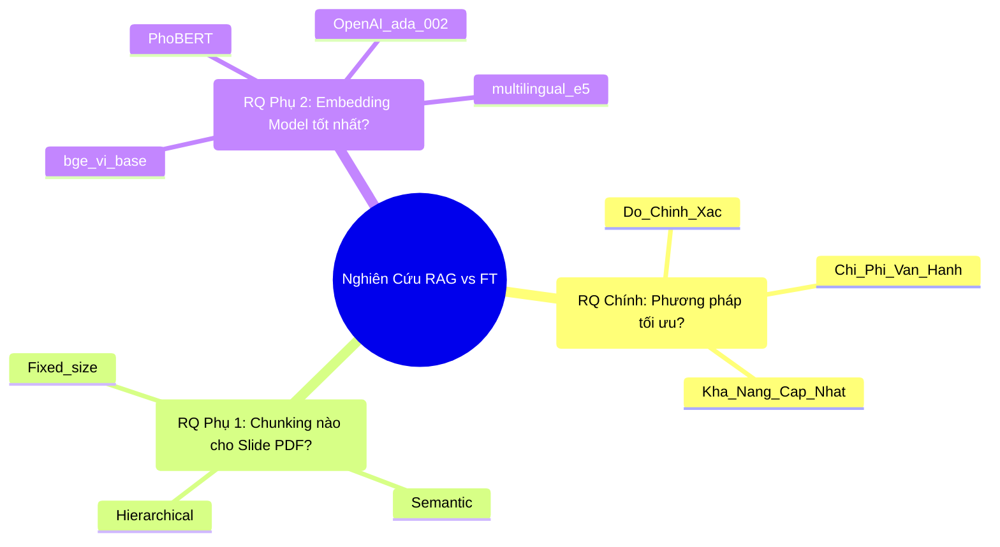
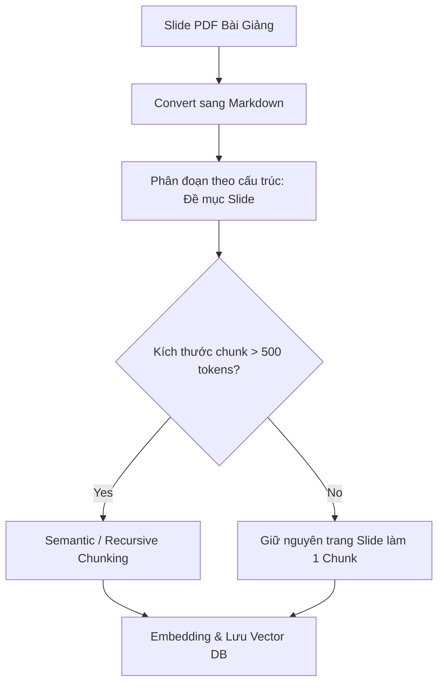

# PHƯƠNG PHÁP NGHIÊN CỨU & SO SÁNH RAG VS FINE-TUNING

Tài liệu này trình bày nền tảng lý thuyết, các câu hỏi nghiên cứu (Research Questions) và phương pháp luận khoa học được sử dụng để thực hiện phần nghiên cứu so sánh trong đồ án/khóa luận của bạn.

---

## 1. Các Câu Hỏi Nghiên Cứu (Research Questions - RQ)

Nghiên cứu tập trung giải quyết 3 câu hỏi cốt lõi sau để tìm ra giải pháp tối ưu cho tiếng Việt:



* **Câu hỏi nghiên cứu chính (RQ chính):** *Phương pháp nào (RAG hay Fine-tuning) mang lại hiệu quả cao hơn cho chatbot hỗ trợ học tập dựa trên tài liệu tiếng Việt khi xét đồng thời cả 3 tiêu chí: độ chính xác (accuracy/hallucination), chi phí triển khai, và khả năng cập nhật tri thức?*
* **Câu hỏi nghiên cứu phụ 1 (RQ phụ 1):** *Chiến lược Chunking nào (Fixed-size, Semantic, hay Hierarchical) tối ưu nhất cho cấu trúc slide PDF bài giảng tiếng Việt nhằm đạt độ chính xác truy xuất cao nhất?*
* **Câu hỏi nghiên cứu phụ 2 (RQ phụ 2):** *Mô hình Embedding tiếng Việt nào (bge-vi-base, PhoBERT, multilingual-e5, hay OpenAI text-embedding-3-small) phù hợp nhất cho bài toán truy xuất ngữ nghĩa tài liệu học tập của sinh viên?*

---

## 2. Khung Lý Thuyết So Sánh (Theoretical Comparison Framework)

Dưới đây là bảng đối sánh lý thuyết tổng hợp dựa trên các nghiên cứu mới nhất năm 2025–2026:

| Tiêu chí | RAG (Retrieval-Augmented Generation) | Fine-tuning (Huấn luyện bổ sung) |
| :--- | :--- | :--- |
| **Độ chính xác & Tránh ảo tưởng (Hallucination)** | **Rất cao**: Cung cấp ngữ cảnh trực tiếp từ Vector DB giúp mô hình trả lời chính xác dữ kiện thô; giảm thiểu tối đa ảo tưởng nhờ dẫn nguồn rõ ràng. | **Trung bình**: Mô hình có xu hướng tự tạo câu trả lời khi gặp dữ liệu nằm ngoài tập huấn luyện; không thể tự động dẫn chứng nguồn gốc. |
| **Chi phí triển khai & Vận hành** | **Thấp**: Chỉ yêu cầu lưu trữ Vector DB và gọi API Embedding; có thể triển khai nhanh chóng trên các server cấu hình thường. | **Rất cao**: Cần hạ tầng GPU mạnh (như A100/H100) để huấn luyện; thời gian huấn luyện dài; đòi hỏi kỹ sư chuyên môn cao. |
| **Khả năng cập nhật kiến thức** | **Tức thời (Tối ưu)**: Chỉ cần thêm/xóa/sửa tài liệu trong Vector DB mà không cần tác động đến mô hình nền LLM. | **Kém (Độ trễ cao)**: Khi tài liệu thay đổi (mỗi học kỳ), bắt buộc phải chuẩn bị lại tập dữ liệu và chạy lại toàn bộ pipeline fine-tuning. |
| **Khả năng tùy biến hành vi (Style/Format)** | **Trung bình**: Điều khiển thông qua Prompt (System Prompt), đôi khi mô hình không tuân thủ hoàn toàn nếu prompt quá dài. | **Rất cao**: Định hình chính xác phong cách phản hồi, cấu trúc đầu ra (e.g. định dạng JSON cố định, giọng điệu giáo viên). |

### Khuyến nghị lựa chọn thực tế cho FPTU Chatbot:
1. **Lựa chọn RAG làm nền tảng chính:** Tài liệu bài giảng và syllabus thay đổi liên tục theo từng kỳ học của trường FPT. RAG cho phép cập nhật tức thời và khả năng trích dẫn nguồn (slide trang mấy) là tính năng vô cùng quan trọng đối với sinh viên để kiểm chứng thông tin học tập.
2. **Kịch bản Hybrid (Tối ưu nhất):** Sử dụng RAG để quản lý và truy xuất tri thức động từ bài giảng, kết hợp với một mô hình LLM đã được Fine-tune nhẹ (hoặc qua prompt-engineering sâu) để định hình giọng điệu trả lời sư phạm thân thiện, dễ hiểu cho sinh viên.

---

## 3. Chiến Lược Chunking Tối Ưu Cho Slide PDF (RQ phụ 1)

Slide bài giảng PDF thường có mật độ chữ thấp, bố cục nhiều bullet points và hình ảnh. Phân tích các chiến lược Chunking:

* **Fixed-size Chunking (Chia theo số ký tự cố định):**
  * *Cách hoạt động:* Cắt văn bản sau mỗi $N$ ký tự (e.g. 500 ký tự) kèm theo overlap $M$ ký tự.
  * *Đánh giá:* Rất nhanh nhưng dễ cắt đôi câu hỏi, mất ngữ cảnh của các bullet points trong slide.
* **Semantic Chunking (Chia theo ngữ nghĩa):**
  * *Cách hoạt động:* Tính toán embedding cho từng câu đơn lẻ, sau đó gom các câu liên tiếp có khoảng cách vector gần nhau lại thành một chunk.
  * *Đánh giá:* Giữ trọn vẹn ngữ nghĩa của chủ đề slide nhưng chi phí tính toán cao.
* **Document-based Chunking (Chia theo cấu trúc slide - Đề xuất tối ưu):**
  * *Cách hoạt động:* Hệ thống phân tích thẻ tiêu đề slide (`# Slide X`, `## Tiêu đề phụ`). Mỗi trang slide được coi là một chunk riêng biệt.
  * *Khuyến nghị:* **Document-based chunking kết hợp Semantic chunking**.



> **Quy trình chuẩn hóa:**
> 1. Trích xuất PDF sang định dạng Markdown để giữ cấu trúc header.
> 2. Chia nhỏ tài liệu theo cấu trúc slide (mỗi slide là một chunk).
> 3. Cấu hình chunk size tối ưu từ 300–500 tokens với overlap 10-20% (khoảng 50-100 tokens) để giữ tính liên tục ngữ nghĩa giữa các slide.

---

## 4. Đánh Giá Các Mô Hình Embedding Tiếng Việt (RQ phụ 2)

Embedding model quyết định trực tiếp khả năng "hiểu" câu hỏi của sinh viên để tìm đúng tài liệu. Dưới đây là bảng so sánh hiệu năng các mô hình nổi bật cho tiếng Việt dựa trên benchmark thực nghiệm STS-Vi (Semantic Textual Similarity) mới nhất:

| Mô hình | Điểm số STS-Vi | MRR@10 (Retrieval) | Tốc độ xử lý (sent/s) | Đặc điểm nổi bật |
| :--- | :---: | :---: | :---: | :--- |
| **BAAI/bge-vi-base** | **0.88** | **0.84** | 950 | **Tối ưu nhất cho RAG tiếng Việt**. Được tinh chỉnh (fine-tuned) trên hàng triệu cặp câu hỏi-đáp tiếng Việt thực tế. |
| **multilingual-e5-base** | 0.85 | 0.80 | 900 | Rất tốt khi môn học có nhiều tài liệu song ngữ (Anh - Việt), nhưng độ nhạy tiếng Việt thuần kém hơn bge-vi-base. |
| **PhoBERT-base** | 0.82 | 0.77 | **1200** | Tốc độ nhanh, nhưng thiết kế cho bài toán phân loại (classification), không tối ưu cho tìm kiếm ngữ nghĩa RAG nếu không fine-tune sâu. |
| **OpenAI text-embedding-3-small** | 0.83 | 0.78 | Phụ thuộc API | Khá tốt nhưng phụ thuộc hoàn toàn vào internet, chi phí API cao và không tối ưu riêng cho cấu trúc ngữ pháp tiếng Việt. |

### Khuyến nghị Pipeline Kỹ Thuật:
* Sử dụng **`BAAI/bge-vi-base`** làm mô hình embedding chính cho RAG tiếng Việt nhờ khả năng biểu diễn ngữ nghĩa vượt trội và mã nguồn mở hoàn toàn, có thể chạy local để bảo mật dữ liệu.
* Nếu hệ thống hỗ trợ cả Video và Audio đa phương thức, sử dụng **`Gemini Embedding 2`** làm pipeline song song để xử lý các tệp media nhờ tính năng Multimodal Native độc quyền của Google.

```python
# Cấu hình pipeline đề xuất bằng Python
from sentence_transformers import SentenceTransformer

# Khởi tạo mô hình embedding tối ưu cho tiếng Việt
embed_model = SentenceTransformer("BAAI/bge-vi-base")

# Hàm sinh vector embedding
def get_vietnamese_embedding(text_chunk):
    # Trả về vector 768 chiều
    return embed_model.encode(text_chunk).tolist()
```
