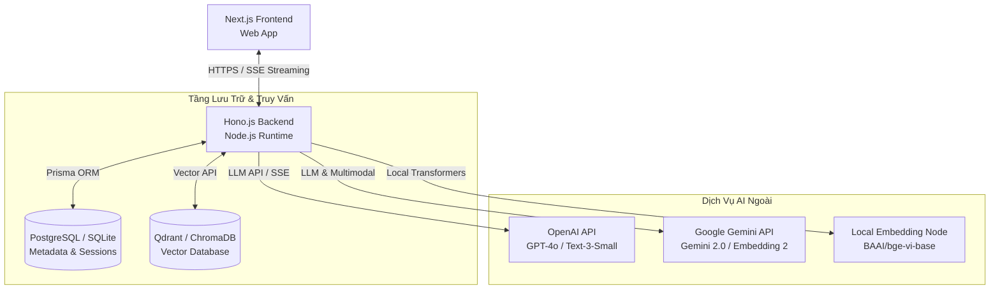
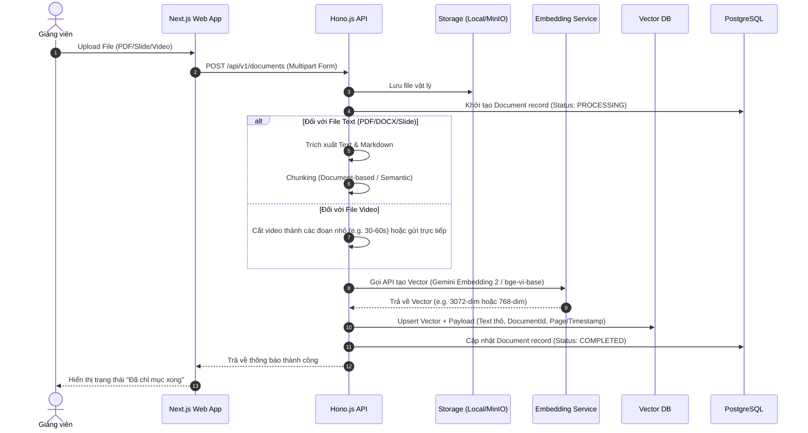
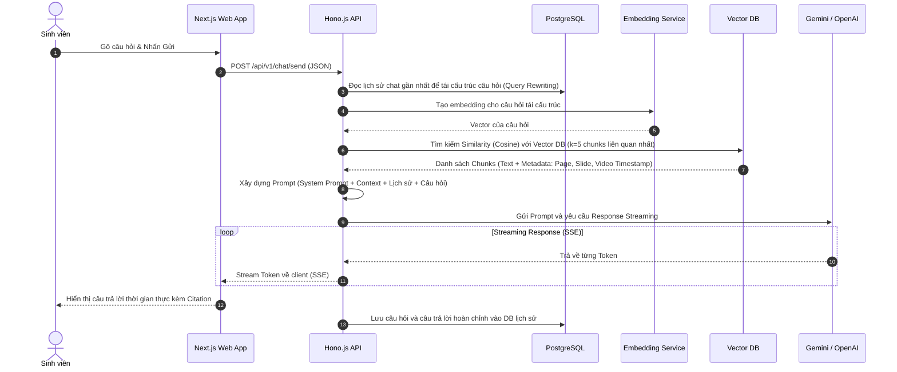

# TÀI LIỆU THIẾT KẾ KIẾN TRÚC & KỸ THUẬT (TECHNICAL & ARCHITECTURE DESIGN)

Tài liệu này trình bày thiết kế kiến trúc hệ thống, luồng dữ liệu chi tiết, đặc tả các API chính và cấu trúc cơ sở dữ liệu của hệ thống **FPTU Chatbot RAG**.

---

## 1. Kiến Trúc Tổng Thể (System Architecture)

Hệ thống được xây dựng theo mô hình **Client-Server** hiện đại, phân tách rõ ràng giữa lớp giao diện (Frontend) và lớp nghiệp vụ (Backend API), kết hợp với các cơ sở dữ liệu chuyên dụng để xử lý dữ liệu quan hệ và dữ liệu vector.



### 1.1 Frontend (Ứng dụng Web)
* **Công nghệ:** **Next.js 15+ (App Router)**, **TypeScript**, **Tailwind CSS**.
* **Đặc điểm nổi bật:**
  * Xây dựng giao diện Responsive, chuẩn UI/UX, hỗ trợ Dark Mode.
  * Tích hợp **Server-Sent Events (SSE)** Client để nhận kết quả dạng stream từ backend giúp hiển thị câu trả lời dạng gõ chữ (typing effect) mượt mà.
  * Trình xem tài liệu PDF và trình phát Video đồng bộ hóa theo Citation Timestamp.

### 1.2 Backend (Dịch vụ API)
* **Công nghệ:** **Hono.js**, **TypeScript**, chạy trên môi trường **Node.js (hoặc Bun)**.
* **Lý do chọn Hono.js:**
  * Siêu nhẹ (ultra-lightweight), tốc độ router cực nhanh.
  * Hỗ trợ native việc streaming phản hồi (SSE) rất đơn giản và tối ưu hiệu năng.
  * Dễ dàng tích hợp với các thư viện xử lý AI như LangChain, LlamaIndex hoặc gọi trực tiếp API của Google/OpenAI.

### 1.3 Tầng dữ liệu (Databases)
* **Cơ sở dữ liệu quan hệ (RDB):** **PostgreSQL** (hoặc SQLite cho môi trường phát triển) kết hợp với **Prisma ORM**. Dùng để lưu trữ dữ liệu người dùng, thông tin khóa học, cấu trúc bài giảng, siêu dữ liệu tài liệu (metadata) và lịch sử các phiên chat.
* **Cơ sở dữ liệu Vector (Vector DB):** **Qdrant** hoặc **ChromaDB**. Dùng để lưu trữ các vector embedding của các phân đoạn tài liệu (chunks) cùng với nội dung text thô để phục vụ tìm kiếm ngữ nghĩa (Semantic Search).

---

## 2. Luồng Dữ Liệu Chi Tiết (Data Flows)

### 2.1 Luồng Tải lên & Index tài liệu (Document Ingestion & Indexing Pipeline)
Giảng viên tải tài liệu lên hệ thống, hệ thống thực hiện tiền xử lý và lưu trữ vector.



### 2.2 Luồng Chat & Hỏi đáp (RAG Chat & Q&A Flow)
Sinh viên gửi câu hỏi, hệ thống truy xuất kiến thức liên quan và sinh câu trả lời.



---

## 3. Pipeline Xử Lý Đa Phương Thức (Multimodal Processing)

Một điểm cải tiến vượt trội của dự án là việc ứng dụng **Native Multimodal Embedding** qua mô hình **Gemini Embedding 2**.

* **Xử lý Video:**
  * Thay vì phải chuyển mã video phức tạp, hệ thống sử dụng API của Google Gemini để trích xuất embedding trực tiếp của các phân đoạn video ngắn (độ dài $\le 120$ giây).
  * Video được lưu trữ cùng với metadata chứa `video_url`, `start_time` và `end_time` (giây).
  * Khi sinh viên hỏi một câu liên quan, cosine similarity sẽ khớp vector câu hỏi của sinh viên với vector của phân đoạn video đó. Hệ thống sẽ trích xuất timestamp tương ứng để sinh viên có thể click vào và xem đúng đoạn giảng viên đang giảng về chủ đề đó.
* **Xử lý Ảnh:**
  * Ảnh sơ đồ thiết kế hệ thống, biểu đồ môn học được trích xuất bằng OCR hoặc Vision model để sinh mô tả text, kết hợp cùng vector gốc của ảnh được nhúng bởi Gemini Embedding 2.

---

## 4. Đặc Tả Hono.js API (Hono.js API Specifications)

Các Endpoint chính được thiết kế chuẩn RESTful API:

### 4.1 Quản lý tài liệu (Document Management)
* **`POST /api/v1/courses/:courseId/documents`**
  * **Mô tả:** Tải tài liệu lên một môn học cụ thể.
  * **Request:** `Multipart/form-data` chứa file và thông tin `chapterId`.
  * **Response:**
    ```json
    {
      "success": true,
      "document": {
        "id": "doc_abc123",
        "name": "Slide_Chuong_1_Quicksort.pdf",
        "status": "PROCESSING",
        "createdAt": "2026-05-19T07:28:00Z"
      }
    }
    ```
* **`GET /api/v1/courses/:courseId/documents`**
  * **Mô tả:** Lấy danh sách tài liệu kèm trạng thái index của môn học.

### 4.2 Luồng Chat & Hội thoại (Chat Endpoints)
* **`POST /api/v1/chat/sessions`**
  * **Mô tả:** Tạo một phiên trò chuyện mới cho một môn học cụ thể.
  * **Request Body:** `{ "courseId": "course_123" }`
* **`POST /api/v1/chat/send`**
  * **Mô tả:** Gửi tin nhắn và nhận stream câu trả lời kèm nguồn trích dẫn.
  * **Request Body:**
    ```json
    {
      "sessionId": "session_xyz789",
      "message": "Thuật toán Quicksort có độ phức tạp thời gian trung bình là bao nhiêu và tìm thấy ở slide nào?"
    }
    ```
  * **Response:** Stream `text/event-stream`. Các gói dữ liệu gửi về dạng JSON chứa:
    * Chunks text tiếp theo.
    * Mảng `citations` chứa thông tin nguồn (được gửi ở gói dữ liệu đầu tiên hoặc cuối cùng):
      ```json
      {
        "citations": [
          {
            "documentName": "Slide_Chuong_1_Quicksort.pdf",
            "page": 12,
            "snippet": "Độ phức tạp trung bình của Quicksort là O(n log n)..."
          }
        ]
      }
      ```

---

## 5. Thiết Kế Cơ Sở Dữ Liệu (Database Schema Design)

Dưới đây là đặc tả cấu trúc cơ sở dữ liệu quan hệ (Prisma Schema syntax):

```prisma
// Đặc tả mô hình Tenant (Trường Đại Học)
model Tenant {
  id        String   @id @default(uuid())
  name      String   // Ví dụ: FPT University Hanoi
  domain    String   @unique
  courses   Course[]
  users     User[]
  createdAt DateTime @default(now())
}

// Người dùng hệ thống
model User {
  id        String        @id @default(uuid())
  email     String        @unique
  name      String
  role      Role          @default(STUDENT) // STUDENT, LECTURER, ADMIN
  tenantId  String
  tenant    Tenant        @relation(fields: [tenantId], references: [id])
  sessions  ChatSession[]
  createdAt DateTime      @default(now())
}

enum Role {
  STUDENT
  LECTURER
  ADMIN
}

// Khóa học / Môn học
model Course {
  id          String        @id @default(uuid())
  code        String        // Ví dụ: SWD392
  name        String        // Ví dụ: Software Architecture
  tenantId    String
  tenant      Tenant        @relation(fields: [tenantId], references: [id])
  documents   Document[]
  sessions    ChatSession[]
  createdAt   DateTime      @default(now())
}

// Tài liệu môn học
model Document {
  id        String   @id @default(uuid())
  name      String   // Tên file gốc
  fileUrl   String   // Đường dẫn lưu trữ vật lý
  fileType  String   // pdf, docx, pptx, mp4
  status    String   // PENDING, PROCESSING, COMPLETED, FAILED
  courseId  String
  course    Course   @relation(fields: [courseId], references: [id])
  createdAt DateTime @default(now())
}

// Phiên chat của Sinh viên
model ChatSession {
  id        String        @id @default(uuid())
  userId    String
  user      User          @relation(fields: [userId], references: [id])
  courseId  String
  course    Course        @relation(fields: [courseId], references: [id])
  messages  ChatMessage[]
  createdAt DateTime      @default(now())
}

// Tin nhắn chi tiết
model ChatMessage {
  id        String      @id @default(uuid())
  sessionId String
  session   ChatSession @relation(fields: [sessionId], references: [id], onDelete: Cascade)
  sender    SenderType  // USER, ASSISTANT
  content   String      @db.Text
  citations Json?       // Lưu trữ mảng citation dạng JSON
  createdAt DateTime    @default(now())
}

enum SenderType {
  USER
  ASSISTANT
}
```

---

> [!IMPORTANT]
> **Tính Bảo Mật Đa Trường (Logical Multi-tenancy Isolation):**
> Mọi truy vấn từ Next.js Client bắt buộc phải đi kèm một JWT token chứa thông tin `tenantId` và `userId`. Hono.js Backend sử dụng Middleware để kiểm tra và đảm bảo người dùng chỉ được phép truy xuất các khóa học (`Course`) và tài liệu (`Document`) thuộc cùng một `tenantId`.
