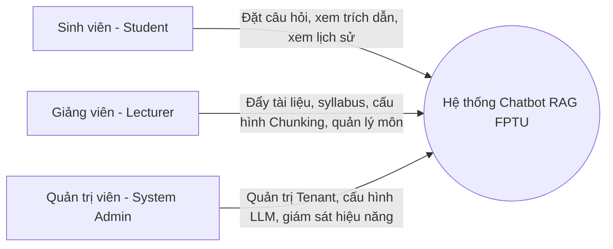

# TÀI LIỆU YÊU CẦU HỆ THỐNG (SYSTEM REQUIREMENTS SPECIFICATION - SRS)

Tài liệu này đặc tả chi tiết các yêu cầu chức năng và phi chức năng của hệ thống **FPTU Chatbot RAG**. Tài liệu được thiết kế nhằm định hình phạm vi phát triển sản phẩm kỹ thuật.

---

## 1. Các Tác Nhân Hệ Thống (Actors) & Phân Quyền

Hệ thống hỗ trợ cơ chế Multi-tenant (Đa trường học / Đa khoa) và phân quyền chi tiết cho 3 nhóm tác nhân chính:

### 1.1 Sinh viên (Student)
* **Mô tả:** Người dùng cuối truy cập để tra cứu, học tập và hỏi đáp kiến thức từ các tài liệu môn học được cung cấp.
* **Quyền hạn:**
  * Đăng nhập bằng tài khoản sinh viên (hỗ trợ Google FPT Mail SSO).
  * Lựa chọn môn học và chương học muốn tập trung hỏi đáp.
  * Chat tự nhiên với chatbot, nhận câu trả lời có kèm nguồn trích dẫn chi tiết (Slide số mấy, trang nào, giây thứ bao nhiêu trong video).
  * Xem, quản lý và tiếp tục lịch sử các phiên chat trước đó.
  * Đánh giá chất lượng câu trả lời (Upvote/Downvote) để hỗ trợ cải tiến hệ thống.

### 1.2 Giảng viên (Lecturer / Course Manager)
* **Mô tả:** Người chịu trách nhiệm học thuật, cung cấp tài liệu giảng dạy và cấu hình tri thức cho chatbot.
* **Quyền hạn:**
  * Tạo môn học mới, phân chia môn học thành các chương/mục (Syllabus-based structure).
  * Upload tài liệu đa phương thức (PDF, DOCX, Slide bài giảng PPTX, Video bài giảng, hình ảnh sơ đồ).
  * Lựa chọn hoặc cấu hình chiến lược Chunking & Embedding cho môn học của mình.
  * Xem danh sách các tài liệu đã được chỉ mục hóa (index), trạng thái xử lý (Success, Processing, Failed), và thực hiện cập nhật/xóa tài liệu khi giáo trình thay đổi.
  * Xem các câu hỏi phổ biến hoặc các câu hỏi bị downvote của sinh viên để điều chỉnh tài liệu.

### 1.3 Quản trị viên hệ thống (System Admin)
* **Mô tả:** Quản lý toàn bộ nền tảng ở cấp độ cơ sở hạ tầng.
* **Quyền hạn:**
  * Quản lý các Tenant (các trường đại học khác nhau hoặc các cơ sở đào tạo).
  * Cấu hình hạn mức API, lựa chọn nhà cung cấp LLM chính (OpenAI, Claude, Gemini).
  * Giám sát hệ thống qua Dashboard: tốc độ phản hồi (latency), tỷ lệ lỗi, số lượng token tiêu thụ, và chi phí vận hành API.

---

## 2. Yêu Cầu Chức Năng (Functional Requirements)

### 2.1 Quản lý tài liệu & Tri thức (Document Ingestion Engine)
Cơ chế nhập và xử lý tài liệu là xương sống của hệ thống RAG. Quy trình gồm các chức năng:

* **Tải lên tài liệu đa định dạng (Multi-format Ingestion):**
  * Văn bản & Tài liệu: `.pdf`, `.docx`, `.txt`.
  * Trình chiếu: `.pptx` (Slide bài giảng).
  * Phương tiện truyền thông: `.mp4`, `.mov` (Video bài giảng dưới 120 giây/file cho demo trực tiếp hoặc hỗ trợ chunk video).
* **Quản lý theo mô hình phân cấp môn học:**
  * Cấu trúc thư mục tri thức: `Trường` -> `Môn học` -> `Chương học` -> `Bài học/Tài liệu`.
  * Cho phép bật/tắt (Enable/Disable) từng tài liệu cụ thể khỏi không gian tìm kiếm RAG của chatbot mà không cần xóa tài liệu khỏi hệ thống.
* **Giám sát Pipeline xử lý (Pipeline Monitoring):**
  * Hệ thống tự động đẩy file vào hàng đợi (Queue), thực hiện tiền xử lý, phân đoạn (Chunking), trích xuất vector (Embedding) và lưu vào Vector DB.
  * Hiển thị tiến trình xử lý thời gian thực cho Giảng viên.

### 2.2 Chat & Hỏi đáp thông minh (Intelligent RAG Chat)
Giao diện hội thoại nâng cao dành cho sinh viên:

* **Trò chuyện đa biến ngữ cảnh (Multi-turn Contextual Conversation):**
  * Chatbot có khả năng ghi nhớ ngữ cảnh tối thiểu 10 lượt hội thoại gần nhất trong phiên.
  * Khả năng tự động viết lại câu hỏi (Query Rewriting) dựa trên lịch sử chat để tối ưu hóa quá trình tìm kiếm vector (e.g. nếu sinh viên hỏi "Thuật toán này chạy thế nào?" sau khi hỏi về "Quicksort", hệ thống tự động hiểu "Thuật toán này" là "Quicksort").
* **Trích dẫn nguồn tài liệu minh bạch (Transparent Citation):**
  * Mỗi câu trả lời của chatbot bắt buộc phải đính kèm các thẻ nguồn trích dẫn.
  * Khi click vào nguồn trích dẫn:
    * Đối với **PDF/Slide**: Hiển thị popup xem trước tài liệu tại đúng trang chứa thông tin.
    * Đối với **Video**: Mở video và tự động tua đến giây (timestamp) được trích dẫn.
* **Giới hạn phạm vi câu trả lời (Knowledge Guardrails & Hallucination Prevention):**
  * Hệ thống áp dụng cấu hình Prompt chặt chẽ. Nếu câu hỏi của sinh viên nằm ngoài phạm vi tri thức có sẵn trong Vector DB của môn học đó, chatbot phải lịch sự từ chối trả lời (ví dụ: *"Xin lỗi, thông tin này không có trong tài liệu môn học của bạn. Tôi chỉ có thể trả lời các vấn đề liên quan đến giáo trình."*), thay vì tự sáng tạo thông tin (hallucination).

### 2.3 Phân tích & Đánh giá (Analytics Dashboard)
* **Thống kê phía Giảng viên:**
  * Biểu đồ tần suất các câu hỏi theo thời gian.
  * Danh sách các chủ đề (keywords) được sinh viên quan tâm nhất.
  * Tổng hợp phản hồi Downvote kèm lý do sinh viên cung cấp (ví dụ: *"Thông tin cũ"*, *"Trích dẫn sai trang"*).
* **Thống kê phía Admin:**
  * Chi phí token của từng môn học / từng Tenant.
  * Thời gian phản hồi trung bình (Time to First Token & Total Latency).

---

## 3. Yêu Cầu Phi Chức Năng (Non-Functional Requirements)

### 3.1 Khả năng mở rộng (Scalability & Multi-Tenancy)
* **Multi-Tenant Isolation:** Dữ liệu tài liệu và cơ sở dữ liệu vector của từng trường phải được cô lập hoàn toàn về mặt logic (Logical isolation). Sinh viên trường A tuyệt đối không thể truy cập hoặc tìm kiếm tài liệu của trường B.
* **Horizontal Scaling:** API viết bằng Hono.js gọn nhẹ, dễ dàng đóng gói Docker và deploy lên các dịch vụ serverless (như Cloudflare Workers, Google Cloud Run) để scale theo số lượng request.

### 3.2 Hiệu năng truy vấn & Trải nghiệm người dùng (Performance & UX)
* **Response Latency:**
  * Quá trình truy xuất dữ liệu (Retrieval) từ Vector DB phải hoàn tất dưới 300ms.
  * Tận dụng cơ chế **Server-Sent Events (SSE) Streaming** để truyền tải câu trả lời từ LLM về giao diện người dùng theo thời gian thực (Time to First Token < 800ms, tổng thời gian trả lời câu hỏi trung bình < 3 giây).
* **Độ chính xác truy xuất (Retrieval Accuracy):**
  * Tỷ lệ trích xuất trúng tài liệu liên quan (Precision@5) đạt tối thiểu 80% đối với các câu hỏi tiếng Việt có trong tài liệu.

### 3.3 Khả năng tương thích Đa phương thức (Multimodal Compatibility)
* **Native Multimodal Embedding:** Hỗ trợ mô hình **Gemini Embedding 2** để lưu trữ các vector dạng hình ảnh và video bài giảng ngắn trực tiếp vào Vector DB. 
* Hệ thống có khả năng xử lý truy vấn chéo phương thức (Cross-modal Retrieval): Sinh viên gõ câu hỏi dạng text, hệ thống tìm ra đoạn video giảng bài tương ứng.

### 3.4 Bảo mật & Tuân thủ (Security & Guardrails)
* **Data Privacy:** Tài liệu bài giảng và thông tin sinh viên FPT phải được mã hóa khi lưu trữ (Encryption at rest) và truyền tải (Encryption in transit via HTTPS).
* **LLM Data Safety:** Đảm bảo dữ liệu gửi lên API của bên thứ ba không bị sử dụng để huấn luyện mô hình công cộng (sử dụng gói Enterprise API của OpenAI/Google hoặc chạy các mô hình local embedding độc lập như `bge-vi-base` trên server riêng).

---

> [!TIP]
> **Trọng tâm demo môn học:** Để phục vụ báo cáo và đánh giá nhanh, hệ thống sẽ được cấu hình demo hoàn chỉnh cho **01 môn học mẫu** (ví dụ: *Software Architecture* hoặc *Kỹ năng học tập đại học*), bao gồm đầy đủ slide, tài liệu đọc và video bài giảng đi kèm.
