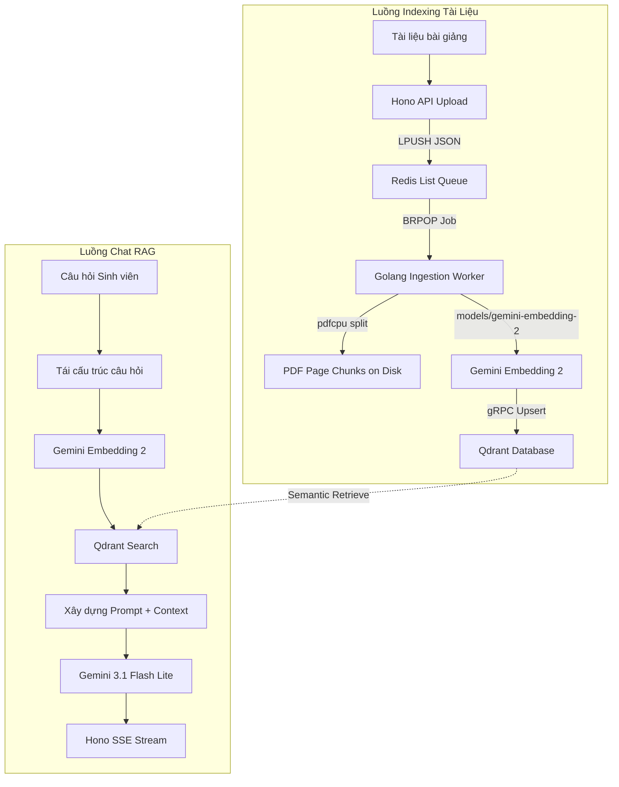

# Kế Hoạch Nghiên Cứu & Triển Khai RAG Cơ Bản (Basic RAG Implementation Plan)

Tài liệu này phác thảo kế hoạch nghiên cứu và triển khai kỹ thuật cho tính năng **RAG (Retrieval-Augmented Generation)** cơ bản vào hệ thống **FPTU Chatbot RAG**. Kế hoạch sử dụng **Qdrant (Self-hosted)** làm Vector Database, **Gemini 3.1 Flash Lite** (`gemini-3.1-flash-lite`) làm mô hình sinh văn bản, và **Gemini Embedding 2** (sử dụng modelpow ổn định **`models/gemini-embedding-2`** hỗ trợ kích thước 3072 chiều) làm mô hình tạo nhúng đa phương thức.

---

## User Review Required

> [!IMPORTANT]
> **Các Điểm Cần Giảng Viên / Nhà Phát Triển Phê Duyệt:**
>
> 1. **Cấu hình Qdrant Service:** Thêm service Qdrant vào `docker-compose.yml` sử dụng biến môi trường bảo mật `QDRANT_API_KEY` từ file `.env` root.
> 2. **Sử dụng bộ SDK Google Gen AI Mới:** Đề xuất cài đặt thư viện `@google/genai` (bộ SDK hợp nhất mới nhất từ Google) thay vì các thư viện cũ để hỗ trợ tối ưu các mô hình Gemini thế hệ mới nhất.
> 3. **Phân Tách Dữ Luận Đa Trường (Multi-tenant Isolation):** Dữ liệu vector trong Qdrant sẽ sử dụng một Collection chung nhưng lọc nghiêm ngặt theo payload chứa `tenant_id` (organization_id) và `course_id` cho từng truy vấn để tránh rò rỉ chéo dữ liệu giữa các trường đại học/khóa học.

---

## Proposed Changes

Kế hoạch phân tách thành các cấu phần chính sau:



---

### 1. Cấu Hình Cơ Sở Hạ Tầng (Infrastructure Setup)

#### [MODIFY] [docker-compose.yml](file:///e:/FPT/Semester_7/SWD392/chatbot-rag-fptu/docker-compose.yml)

Thêm service Qdrant tự lưu trữ (self-hosted) sử dụng volume riêng để bảo toàn dữ liệu và cấu hình API Key nhằm bảo mật truy cập.

```diff
 services:
   db:
     image: postgres:17-alpine
     container_name: chatbot-rag-postgres
     restart: always
     environment:
       POSTGRES_USER: ${POSTGRES_USER}
       POSTGRES_PASSWORD: ${POSTGRES_PASSWORD}
       POSTGRES_DB: ${POSTGRES_DB}
     ports:
       - "${POSTGRES_PORT}:5432"
     volumes:
       - postgres_data:/var/lib/postgresql/data

+  qdrant:
+    image: qdrant/qdrant:latest
+    container_name: chatbot-rag-qdrant
+    restart: always
+    ports:
+      - "6333:6333"
+      - "6334:6334"
+    environment:
+      - QDRANT__SERVICE__API_KEY=${QDRANT_API_KEY}
+    volumes:
+      - qdrant_data:/qdrant/storage
+
+  redis:
+    image: redis:7-alpine
+    container_name: chatbot-rag-redis
+    restart: always
+    ports:
+      - "6379:6379"
+    volumes:
+      - redis_data:/data
+
 volumes:
   postgres_data:
+  qdrant_data:
+  redis_data:
```

---

### 2. Cài Đặt dependencies & SDK trong API Workspace

#### [MODIFY] [package.json](file:///e:/FPT/Semester_7/SWD392/chatbot-rag-fptu/api/package.json)

Cài đặt thư viện Qdrant JS client chính thức (`@qdrant/js-client-sdk`), SDK Google Gen AI mới (`@google/genai`) và thư viện phân tích PDF (`pdf-parse`).

```diff
   "dependencies": {
     "@hono/node-server": "^1.19.14",
+    "@google/genai": "^0.1.1",
+    "@qdrant/js-client-sdk": "^1.9.0",
     "@prisma/client": "^5.18.0",
     "better-auth": "^1.6.11",
+    "ioredis": "^5.4.1",
     "hono": "^4.12.19"
   },
   "devDependencies": {
     "@types/node": "^20.11.17",
```

---

### 3. Thiết Kế & Xây Dựng Hệ Thống RAG Core (`api/src/modules/rag`)

Tạo module RAG độc lập để chịu trách nhiệm toàn bộ về Embedding, Lưu trữ vector và Truy hồi thông tin.

#### [NEW] [qdrant.service.ts](file:///e:/FPT/Semester_7/SWD392/chatbot-rag-fptu/api/src/modules/rag/services/qdrant.service.ts)

Dịch vụ giao tiếp với Qdrant Vector Database, bao gồm việc tạo Collection, chỉ mục vector và tìm kiếm tương đồng nâng cao có tích hợp filter đa trường (multi-tenant filtering).

```typescript
import { QdrantClient } from "@qdrant/js-client-sdk";
import { ENV } from "../../../config/env.js";

export class QdrantService {
  private static client: QdrantClient;

  public static getClient(): QdrantClient {
    if (!this.client) {
      this.client = new QdrantClient({
        url: ENV.QDRANT_URL,
        apiKey: ENV.QDRANT_API_KEY || undefined,
      });
    }
    return this.client;
  }

  /**
   * Tạo collection lưu trữ tài liệu nếu chưa tồn tại.
   * Sử dụng Vector kích thước 3072 chiều tương thích với Gemini Embedding 2.
   */
  public static async ensureCollection(collectionName: string) {
    const qdrant = this.getClient();
    try {
      const collections = await qdrant.getCollections();
      const exists = collections.collections.some(
        (c) => c.name === collectionName,
      );

      if (!exists) {
        await qdrant.createCollection(collectionName, {
          vectors: {
            size: 3072, // Chiều của Gemini Embedding 2
            distance: "Cosine",
          },
        });
        console.log(
          `[Qdrant] Collection '${collectionName}' created successfully.`,
        );
      }
    } catch (error) {
      console.error(`[Qdrant] Error ensuring collection:`, error);
      throw error;
    }
  }

  /**
   * Chỉ mục danh sách các chunks tài liệu vào Qdrant
   */
  public static async upsertChunks(
    collectionName: string,
    points: Array<{
      id: string;
      vector: number[];
      payload: {
        organizationId: string;
        courseId: string;
        documentId: string;
        documentName: string;
        text: string;
        page?: number;
        timestampStart?: number;
        timestampEnd?: number;
      };
    }>,
  ) {
    const qdrant = this.getClient();
    await this.ensureCollection(collectionName);

    await qdrant.upsert(collectionName, {
      wait: true,
      points: points.map((p) => ({
        id: p.id,
        vector: p.vector,
        payload: p.payload,
      })),
    });
  }

  /**
   * Tìm kiếm tương đồng ngữ nghĩa kết hợp lọc bảo mật Multi-tenant
   */
  public static async searchSimilarity(
    collectionName: string,
    queryVector: number[],
    organizationId: string,
    courseId: string,
    limit = 5,
  ) {
    const qdrant = this.getClient();
    await this.ensureCollection(collectionName);

    return qdrant.search(collectionName, {
      vector: queryVector,
      limit,
      filter: {
        must: [
          {
            key: "organizationId",
            match: { value: organizationId },
          },
          {
            key: "courseId",
            match: { value: courseId },
          },
        ],
      },
    });
  }
}
```

#### [NEW] [gemini.service.ts](file:///e:/FPT/Semester_7/SWD392/chatbot-rag-fptu/api/src/modules/rag/services/gemini.service.ts)

Dịch vụ kết nối API của Google Gemini, tạo embedding đa phương thức 3072 chiều và thực hiện sinh lời thoại streaming.

```typescript
import { GoogleGenAI } from "@google/genai";
import { ENV } from "../../../config/env.js";

export class GeminiService {
  private static ai: GoogleGenAI;

  private static getSdk(): GoogleGenAI {
    if (!this.ai) {
      this.ai = new GoogleGenAI({ apiKey: ENV.GEMINI_API_KEY });
    }
    return this.ai;
  }

  /**
   * Tạo Embedding 3072 chiều bằng Gemini Embedding 2
   * Hỗ trợ cả nhúng văn bản và payload đa phương thức (PDF, image, audio, video)
   */
  public static async generateEmbedding(
    contents: string | any,
  ): Promise<number[]> {
    const ai = this.getSdk();
    const response = await ai.models.embedContent({
      model: "models/gemini-embedding-2",
      contents,
    });

    if (!response.embedding?.values) {
      throw new Error("[Gemini] Failed to generate embedding values.");
    }
    return response.embedding.values;
  }

  /**
   * Sinh câu trả lời Streaming từ context tài liệu (RAG Prompt)
   */
  public static async generateChatStream(
    systemPrompt: string,
    chatHistory: Array<{ role: "user" | "model"; parts: string[] }>,
    userMessage: string,
    contextParts: any[], // Mảng các Base64 PDF chunks từ Retrieval
    onChunk: (text: string) => void,
  ): Promise<string> {
    const ai = this.getSdk();
    const modelName = process.env.GEMINI_TEXT_MODEL || "gemini-3.1-flash-lite";

    // Nhúng toàn bộ Context PDF vào luồng tin nhắn user hiện tại
    const contents = [
      ...chatHistory.map((h) => ({
        role: h.role,
        parts: h.parts.map((p) => ({ text: p })),
      })),
      {
        role: "user",
        parts: [
          { text: "Dưới đây là các tài liệu truy xuất được đính kèm:" },
          ...contextParts,
          { text: `\n\nCâu hỏi của sinh viên: ${userMessage}` },
        ],
      },
    ];

    const responseStream = await ai.models.generateContentStream({
      model: modelName,
      contents,
      config: {
        systemInstruction: systemPrompt,
        temperature: 0.2, // Giảm sáng tạo để tăng độ chính xác trích xuất kiến thức
      },
    });

    let fullText = "";
    for await (const chunk of responseStream) {
      const chunkText = chunk.text || "";
      fullText += chunkText;
      onChunk(chunkText);
    }

    return fullText;
  }
}
```

#### [NEW] [rag.service.ts](file:///e:/FPT/Semester_7/SWD392/chatbot-rag-fptu/api/src/modules/rag/services/rag.service.ts)

Dịch vụ phối hợp (Orchestrator) liên kết các luồng xử lý văn bản, chunking tài liệu, chỉ mục và trả lời câu hỏi.

```typescript
import { DocumentRepository } from "../../documents/repositories/document.repository.js";
import { QdrantService } from "./qdrant.service.js";
import { GeminiService } from "./gemini.service.js";

export class RagService {
  private static COLLECTION_NAME = "fptu_rag_documents";

  // Lưu ý: Hàm xử lý PDF đã được chuyển sang BullMQ Worker nền độc lập
  // để tránh chiếm dụng CPU của Main Thread (Node.js). Hono API chỉ đẩy job vào Redis.

  /**
   * Truy xuất ngữ cảnh kiến thức và sinh câu trả lời
   */
  public static async retrieveAndGenerate(
    query: string,
    courseId: string,
    organizationId: string,
    chatHistory: Array<{ role: "user" | "model"; parts: string[] }>,
    onChunk: (text: string) => void,
  ) {
    // 1. Tạo embedding cho câu hỏi của sinh viên bằng định dạng prefix bất đối xứng
    const queryPrompt = `task: question answering | query: ${query}`;
    const queryVector = await GeminiService.generateEmbedding(queryPrompt);

    // 2. Truy xuất k=5 phân đoạn tài liệu phù hợp nhất từ Qdrant
    // Đảm bảo an toàn đa trường bằng cách lọc theo organizationId và courseId
    const searchResults = await QdrantService.searchSimilarity(
      this.COLLECTION_NAME,
      queryVector,
      organizationId,
      courseId,
      5,
    );

    // 3. Xây dựng ngữ cảnh Đa phương thức (Context)
    // Tải trực tiếp file chunk PDF của từng trang từ đĩa và đẩy dạng Base64 vào Prompt
    const contextParts: any[] = [];
    const citations: any[] = [];

    for (let i = 0; i < searchResults.length; i++) {
      const res = searchResults[i];
      const payload = res.payload as any;

      // Đọc file chunk PDF đã lưu từ đĩa trong lúc Ingestion
      const chunkPath = `./uploads/chunks/${payload.documentId}_page_${payload.page}.pdf`;
      const chunkBuffer = await require("node:fs/promises")
        .readFile(chunkPath)
        .catch(() => null);

      if (chunkBuffer) {
        const base64Data = chunkBuffer.toString("base64");
        contextParts.push({
          text: `[Nguồn ${i + 1}] Tài liệu: ${payload.documentName}, Trang: ${payload.page}`,
        });
        contextParts.push({
          inlineData: { mimeType: "application/pdf", data: base64Data },
        });
      }

      citations.push({
        documentName: payload.documentName,
        page: payload.page,
      });
    }

    // 4. Xây dựng System Instruction cho Gemini
    const systemPrompt = `Bạn là trợ lý giảng dạy AI thông minh của Đại học FPT (FPTU). 
Nhiệm vụ của bạn là giải đáp thắc mắc môn học dựa TRÊN các Tài liệu đính kèm (dưới dạng file PDF/Hình ảnh).

HƯỚNG DẪN TRẢ LỜI:
1. Hãy phân tích kỹ các trang tài liệu PDF được đính kèm trong câu hỏi. Nếu tài liệu không chứa thông tin, hãy lịch sự từ chối.
2. Trả lời bằng tiếng Việt dễ hiểu, logic. Khi trích dẫn thông tin, hãy ghi rõ nguồn (VD: Slide_Chuong_1.pdf - trang 12).`;

    // 5. Sinh câu trả lời dạng Streaming qua Gemini API
    // Kết hợp System Prompt, History, Câu hỏi sinh viên và cả CÁC FILE PDF VỪA RETRIEVE
    const fullAnswer = await GeminiService.generateChatStream(
      systemPrompt,
      chatHistory,
      query,
      contextParts, // Truyền trực tiếp PDF chunks vào Model
      onChunk,
    );

    return {
      citations,
      fullAnswer,
    };
  }
}
```

---

### 4. Tích Hợp API Endpoint Trên Hono.js

Cập nhật các API endpoints hiện có tại `api/src/modules` để sử dụng dịch vụ RAG.

#### [NEW] [rag.controller.ts](file:///e:/FPT/Semester_7/SWD392/chatbot-rag-fptu/api/src/modules/rag/rag.controller.ts)

Tạo controller để quản lý tài liệu tải lên cho môn học và chạy nền tiến trình Indexing.

```typescript
import { Hono } from "hono";
import { RagService } from "./services/rag.service.js";
import { DocumentRepository } from "../documents/repositories/document.repository.js";
import { auth } from "../auth/auth.js";

export const ragRouter = new Hono();

/**
 * Tải file và kích hoạt index tài liệu vào Vector DB
 */
ragRouter.post("/:courseId/documents", async (c) => {
  const session = await auth.api.getSession({ headers: c.req.raw.headers });
  if (!session || !session.user) {
    return c.json({ error: "Unauthorized" }, 401);
  }

  const courseId = c.req.param("courseId");
  const organizationId = session.session.activeOrganizationId;

  if (!organizationId) {
    return c.json(
      { error: "Tenant context is missing (Organization ID required)" },
      400,
    );
  }

  const body = await c.req.parseBody();
  const file = body.file as File;

  if (!file) {
    return c.json({ error: "No file uploaded" }, 400);
  }

  // 1. Tạo document record ở trạng thái PENDING
  const arrayBuffer = await file.arrayBuffer();
  const buffer = Buffer.from(arrayBuffer);

  // Lưu file vào disk để worker có thể đọc
  const fileName = `${Date.now()}_${file.name}`;
  const filePath = `/uploads/${fileName}`; // Cần map volume /uploads giữa API và Worker
  await require("node:fs/promises").writeFile(`.${filePath}`, buffer);

  const doc = await DocumentRepository.create({
    name: file.name,
    fileUrl: filePath,
    fileType: file.name.split(".").pop() || "pdf",
    status: "PENDING",
    course: { connect: { id: courseId } },
  });

  // 2. Chạy tiến trình đẩy Job vào Redis Queue bằng Redis LPUSH (Non-blocking)
  const Redis = require("ioredis");
  const redisClient = new Redis({
    host: process.env.REDIS_HOST || "localhost",
    port: 6379,
  });

  const jobPayload = {
    documentId: doc.id,
    organizationId,
    courseId,
    filePath: `.${filePath}`,
    documentName: doc.name,
  };

  await redisClient.lpush("rag:ingestion:queue", JSON.stringify(jobPayload));
  await redisClient.quit();

  return c.json({
    success: true,
    document: {
      id: doc.id,
      name: doc.name,
      status: "PROCESSING",
    },
  });
});
```

#### [NEW] [document.internal.controller.ts](file:///e:/FPT/Semester_7/SWD392/chatbot-rag-fptu/api/src/modules/documents/document.internal.controller.ts)

Webhook bảo mật nội bộ để Golang Ingestion Worker cập nhật trạng thái tài liệu vào PostgreSQL DB.

```typescript
import { Hono } from "hono";
import { DocumentRepository } from "../documents/repositories/document.repository.js";

export const internalRouter = new Hono();

internalRouter.patch("/documents/:id", async (c) => {
  const authHeader = c.req.header("Authorization");
  const internalKey = process.env.INTERNAL_API_KEY;

  if (!internalKey || authHeader !== `Bearer ${internalKey}`) {
    return c.json({ error: "Unauthorized" }, 401);
  }

  const docId = c.req.param("id");
  const { status, error } = await c.req.json();

  await DocumentRepository.updateStatus(docId, status, error);

  return c.json({ success: true });
});
```

#### [MODIFY] [chat.controller.ts](file:///e:/FPT/Semester_7/SWD392/chatbot-rag-fptu/api/src/modules/chat/chat.controller.ts)

Tích hợp Server-Sent Events (SSE) và RAG Pipeline để sinh câu trả lời trực tuyến từ câu hỏi của sinh viên.

> [!NOTE]
> _Hono cung cấp helper streaming chính thức `hono/streaming` giúp stream câu chữ theo chuẩn SSE vô cùng dễ dàng._

```typescript
import { Hono } from "hono";
import { streamSSE } from "hono/streaming";
import { ChatRepository } from "./repositories/chat.repository.js";
import { RagService } from "../rag/services/rag.service.js";
import { auth } from "../auth/auth.js";

export const chatRouter = new Hono();

chatRouter.post("/send", async (c) => {
  const session = await auth.api.getSession({ headers: c.req.raw.headers });
  if (!session || !session.user) {
    return c.json({ error: "Unauthorized" }, 401);
  }

  const { sessionId, message } = await c.req.json();
  const chatSession = await ChatRepository.findSessionById(sessionId);

  if (!chatSession) {
    return c.json({ error: "Chat session not found" }, 404);
  }

  const organizationId = session.session.activeOrganizationId;
  if (!organizationId) {
    return c.json(
      { error: "Tenant context is missing (Organization ID required)" },
      400,
    );
  }

  // Chuyển đổi lịch sử chat của phiên cho phù hợp định dạng Gemini
  const chatHistory = chatSession.messages.map((m) => ({
    role: m.sender === "USER" ? ("user" as const) : ("model" as const),
    parts: [m.content],
  }));

  // Lưu tin nhắn của sinh viên vào SQL DB trước
  await ChatRepository.createMessage({
    session: { connect: { id: sessionId } },
    sender: "USER",
    content: message,
  });

  // Trả về stream SSE trực tuyến cho sinh viên
  return streamSSE(c, async (stream) => {
    let citationsToSend: any[] = [];
    let accumulatedAnswer = "";

    try {
      const ragResult = await RagService.retrieveAndGenerate(
        message,
        chatSession.courseId,
        organizationId,
        chatHistory,
        async (chunk) => {
          accumulatedAnswer += chunk;
          // Stream từng từ về client
          await stream.writeSSE({
            data: JSON.stringify({ chunk }),
            event: "message",
          });
        },
      );

      citationsToSend = ragResult.citations;

      // Gửi toàn bộ citations và kết thúc stream
      await stream.writeSSE({
        data: JSON.stringify({ citations: citationsToSend }),
        event: "citations",
      });

      // Lưu tin nhắn trợ lý AI kèm citations vào PostgreSQL
      await ChatRepository.createMessage({
        session: { connect: { id: sessionId } },
        sender: "ASSISTANT",
        content: accumulatedAnswer,
        citations: citationsToSend as any,
      });
    } catch (err: any) {
      console.error("[Chat Stream Error]:", err);
      await stream.writeSSE({
        data: JSON.stringify({ error: err.message || "Lỗi xử lý AI RAG" }),
        event: "error",
      });
    }
  });
});
```

---

### 3.5. Golang Ingestion Worker (`services/ingestion-worker/`)

Để tối ưu hóa hiệu năng, giảm tải CPU và đặc biệt là tối ưu hóa dung lượng RAM (tránh các lỗi Heap Out of Memory của V8 Node.js khi phân tách các file PDF bài giảng hàng trăm trang), toàn bộ luồng Ingestion Worker được chuyển dịch sang ngôn ngữ **Golang**.

Worker chạy độc lập dưới dạng một ứng dụng Go siêu nhỏ (microservice) sử dụng hàng đợi Redis (`rag:ingestion:queue`) qua phương thức chặn `BRPop`. Nó sử dụng thư viện `pdfcpu` thuần Go để cắt trang PDF và giao tiếp trực tiếp với Qdrant qua gRPC client cực kỳ nhanh.

Khi cập nhật trạng thái tài liệu (`PROCESSING` -> `COMPLETED` / `FAILED`), Go Worker sẽ gọi một webhook endpoint bảo mật nội bộ `PATCH /api/v1/internal/documents/:id` của Node.js API để đồng bộ trạng thái PostgreSQL, giúp Go Worker cực kỳ nhẹ nhàng và không cần kết nối trực tiếp đến PostgreSQL DB.

#### [NEW] [main.go](file:///e:/FPT/Semester_7/SWD392/chatbot-rag-fptu/services/ingestion-worker/main.go)

```go
package main

import (
	"bytes"
	"context"
	"encoding/base64"
	"encoding/json"
	"fmt"
	"io"
	"log"
	"math"
	"net/http"
	"os"
	"path/filepath"
	"time"

	"github.com/google/uuid"
	"github.com/pdfcpu/pdfcpu/pkg/api"
	"github.com/qdrant/go-client/qdrant"
	"github.com/redis/go-redis/v9"
)

type JobPayload struct {
	DocumentId     string `json:"documentId"`
	OrganizationId string `json:"organizationId"`
	CourseId       string `json:"courseId"`
	FilePath       string `json:"filePath"`
	DocumentName   string `json:"documentName"`
}

var ctx = context.Background()

func main() {
	redisHost := getEnv("REDIS_HOST", "localhost")
	redisPort := getEnv("REDIS_PORT", "6379")
	qdrantURL := getEnv("QDRANT_URL", "http://localhost:6334")
	qdrantKey := os.Getenv("QDRANT_API_KEY")

	// 1. Kết nối Redis
	rdb := redis.NewClient(&redis.Options{
		Addr: fmt.Sprintf("%s:%s", redisHost, redisPort),
	})
	defer rdb.Close()

	// 2. Kết nối Qdrant gRPC
	qClient, err := qdrant.NewClient(&qdrant.Config{
		AnysyncgRPCEndpoint: qdrantURL,
		APIKey:              qdrantKey,
		UseTLS:              false,
	})
	if err != nil {
		log.Fatalf("[Qdrant] Failed to create client: %v", err)
	}
	defer qClient.Close()

	log.Println("[Worker] Golang Ingestion Worker is running and listening to queue...")

	// 3. Vòng lặp lắng nghe Hàng đợi Redis
	for {
		// Dùng BRPOP để chặn chờ Job (timeout = 0 nghĩa là chờ vô hạn)
		result, err := rdb.BRPop(ctx, 0, "rag:ingestion:queue").Result()
		if err != nil {
			log.Printf("[Redis] Error popping from queue: %v", err)
			time.Sleep(1 * time.Second)
			continue
		}

		// result[0] là tên key ("rag:ingestion:queue"), result[1] là payload JSON
		payloadStr := result[1]
		var payload JobPayload
		if err := json.Unmarshal([]byte(payloadStr), &payload); err != nil {
			log.Printf("[Worker] Failed to unmarshal job payload: %v", err)
			continue
		}

		log.Printf("[Worker] Start processing document: %s (%s)", payload.DocumentName, payload.DocumentId)

		// Kích hoạt webhook báo trạng thái: PROCESSING
		updateDocumentStatus(payload.DocumentId, "PROCESSING", "")

		err = processDocument(payload, qClient)
		if err != nil {
			log.Printf("[Worker] Failed to process document %s: %v", payload.DocumentId, err)
			updateDocumentStatus(payload.DocumentId, "FAILED", err.Error())
		} else {
			log.Printf("[Worker] Successfully processed document %s", payload.DocumentId)
			updateDocumentStatus(payload.DocumentId, "COMPLETED", "")
		}
	}
}

func processDocument(payload JobPayload, qClient *qdrant.Client) error {
	// Kiểm tra sự tồn tại của file PDF gốc
	if _, err := os.Stat(payload.FilePath); os.IsNotExist(err) {
		return fmt.Errorf("file does not exist: %s", payload.FilePath)
	}

	// Tạo thư mục chunks tạm thời
	chunksDir := "./uploads/chunks"
	if err := os.MkdirAll(chunksDir, 0755); err != nil {
		return fmt.Errorf("failed to create chunks dir: %v", err)
	}

	// 1. Sử dụng pdfcpu để trích xuất/cắt nhỏ PDF thành các file 1 trang
	log.Printf("[pdfcpu] Splitting PDF: %s", payload.FilePath)
	err := api.SplitFile(payload.FilePath, chunksDir, 1, nil)
	if err != nil {
		return fmt.Errorf("pdfcpu split error: %v", err)
	}

	// Quét các file PDF trang đơn đã được tạo
	baseName := filepath.Base(payload.FilePath)
	baseNameWithoutExt := baseName[:len(baseName)-len(filepath.Ext(baseName))]

	pageNumber := 1
	for {
		expectedChunkPath := filepath.Join(chunksDir, fmt.Sprintf("%s_%d.pdf", baseNameWithoutExt, pageNumber))
		if _, err := os.Stat(expectedChunkPath); os.IsNotExist(err) {
			break // Hết các trang PDF
		}

		// Đọc file trang đơn thành bytes
		pageBytes, err := os.ReadFile(expectedChunkPath)
		if err != nil {
			return fmt.Errorf("failed to read page %d chunk: %v", pageNumber, err)
		}

		// Rename lại file chunk cho khớp với định dạng: <documentId>_page_<pageNumber>.pdf
		targetChunkPath := filepath.Join(chunksDir, fmt.Sprintf("%s_page_%d.pdf", payload.DocumentId, pageNumber))
		err = os.Rename(expectedChunkPath, targetChunkPath)
		if err != nil {
			return fmt.Errorf("failed to rename chunk path: %v", err)
		}

		// Chuyển sang Base64
		pageBase64 := base64.StdEncoding.EncodeToString(pageBytes)

		// 2. Tạo Embedding qua Gemini API với cơ chế retry Exponential Backoff
		vector, err := generateEmbeddingWithRetry(pageBase64, payload.DocumentName, pageNumber)
		if err != nil {
			return fmt.Errorf("gemini embedding error on page %d: %v", pageNumber, err)
		}

		// 3. Upsert vào Qdrant qua gRPC Client
		collectionName := "fptu_rag_documents"

		err = qClient.Upsert(context.Background(), &qdrant.UpsertPoints{
			CollectionName: collectionName,
			Points: []*qdrant.PointStruct{
				{
					Id:     qdrant.NewIDUUID(uuid.NewString()),
					Vector: qdrant.NewVector(vector...),
					Payload: qdrant.NewValueMap(map[string]interface{}{
						"organizationId": payload.OrganizationId,
						"courseId":       payload.CourseId,
						"documentId":     payload.DocumentId,
						"documentName":   payload.DocumentName,
						"page":           pageNumber,
					}),
				},
			},
		})
		if err != nil {
			return fmt.Errorf("qdrant upsert error on page %d: %v", pageNumber, err)
		}

		pageNumber++
	}

	// 4. Dọn dẹp file PDF gốc nháp
	_ = os.Remove(payload.FilePath)
	return nil
}

func generateEmbeddingWithRetry(base64Data string, docName string, page int) ([]float32, error) {
	geminiKey := os.Getenv("GEMINI_API_KEY")
	if geminiKey == "" {
		return nil, fmt.Errorf("GEMINI_API_KEY environment variable is empty")
	}

	maxRetries := 5
	baseDelayMs := 2000.0

	url := fmt.Sprintf("https://generativelanguage.googleapis.com/v1beta/models/gemini-embedding-2:embedContent?key=%s", geminiKey)

	payloadMap := map[string]interface{}{
		"model": "models/gemini-embedding-2",
		"content": map[string]interface{}{
			"parts": []interface{}{
				map[string]interface{}{
					"text": fmt.Sprintf("Document: %s | Page: %d", docName, page),
				},
				map[string]interface{}{
					"inlineData": map[string]interface{}{
						"mimeType": "application/pdf",
						"data":     base64Data,
					},
				},
			},
		},
	}

	payloadBytes, err := json.Marshal(payloadMap)
	if err != nil {
		return nil, err
	}

	for attempt := 0; attempt <= maxRetries; attempt++ {
		req, err := http.NewRequest("POST", url, bytes.NewBuffer(payloadBytes))
		if err != nil {
			return nil, err
		}
		req.Header.Set("Content-Type", "application/json")

		client := &http.Client{Timeout: 30 * time.Second}
		resp, err := client.Do(req)
		if err != nil {
			if attempt < maxRetries {
				delay := time.Duration(baseDelayMs*math.Pow(2, float64(attempt))) * time.Millisecond
				time.Sleep(delay)
				continue
			}
			return nil, err
		}
		defer resp.Body.Close()

		if resp.StatusCode == 429 && attempt < maxRetries {
			delay := time.Duration(baseDelayMs*math.Pow(2, float64(attempt))) * time.Millisecond
			time.Sleep(delay)
			continue
		}

		if resp.StatusCode != http.StatusOK {
			bodyBytes, _ := io.ReadAll(resp.Body)
			return nil, fmt.Errorf("gemini api returned status %d: %s", resp.StatusCode, string(bodyBytes))
		}

		var result struct {
			Embedding struct {
				Values []float32 `json:"values"`
			} `json:"embedding"`
		}

		if err := json.NewDecoder(resp.Body).Decode(&result); err != nil {
			return nil, err
		}

		return result.Embedding.Values, nil
	}

	return nil, fmt.Errorf("failed to generate embedding after retries")
}

func updateDocumentStatus(docId string, status string, errorMessage string) {
	apiURL := getEnv("INTERNAL_API_URL", "http://localhost:3000")
	internalKey := os.Getenv("INTERNAL_API_KEY")

	url := fmt.Sprintf("%s/api/v1/internal/documents/%s", apiURL, docId)

	payload := map[string]string{
		"status": status,
		"error":  errorMessage,
	}
	payloadBytes, _ := json.Marshal(payload)

	req, err := http.NewRequest("PATCH", url, bytes.NewBuffer(payloadBytes))
	if err != nil {
		log.Printf("[Webhook] Failed to create request: %v", err)
		return
	}
	req.Header.Set("Content-Type", "application/json")
	req.Header.Set("Authorization", fmt.Sprintf("Bearer %s", internalKey))

	client := &http.Client{Timeout: 5 * time.Second}
	resp, err := client.Do(req)
	if err != nil {
		log.Printf("[Webhook] Failed to call webhook: %v", err)
		return
	}
	defer resp.Body.Close()

	if resp.StatusCode != http.StatusOK {
		log.Printf("[Webhook] Webhook status error: %d", resp.StatusCode)
	}
}

func getEnv(key, fallback string) string {
	if value, ok := os.LookupEnv(key); ok {
		return value
	}
	return fallback
}
}
```

---

---

## Verification Plan

### Kế Hoạch Kiểm Thử Tự Động (Automated Tests)

1. **Kiểm thử Qdrant Connection:**
   Chạy tệp script kiểm thử kết nối và tạo collection trong `api/src/scripts/test-qdrant.ts` để chắc chắn SDK kết nối ổn định tới docker-compose service.
   - Lệnh kiểm thử: `npx tsx src/scripts/test-qdrant.ts`

2. **Kiểm thử Gemini Embedding:**
   Tạo script sinh vector kiểm tra số lượng chiều của Gemini Embedding 2 có trả về chuẩn xác 3072 chiều hay không.
   - Lệnh kiểm thử: `npx tsx src/scripts/test-gemini.ts`

### Kế Hoạch Kiểm Thử Thủ Công (Manual Verification)

1. **Khởi chạy docker compose:**

   ```bash
   docker compose up -d
   ```

   Kiểm tra Qdrant Dashboard hoạt động ổn định tại cổng: `http://localhost:6333/dashboard`.

2. **Tải lên tài liệu PDF thông qua API:**
   Sử dụng cURL hoặc Postman gửi file PDF bài giảng và kiểm tra status chuyển đổi từ `PENDING` -> `PROCESSING` -> `COMPLETED`.
3. **Thực hiện gửi Chat hỏi đáp:**
   Sử dụng Postman / Client gọi `POST /api/v1/chat/send` kiểm tra dữ liệu SSE được stream theo thời gian thực và trả về đúng citations của các Slide bài giảng.

## Review Status

- Delete-path tenant scoping is resolved: the delete handler now requires `activeOrganizationId` and validates course ownership before destructive work.
- Delete-path idempotency is resolved: missing documents return success and Prisma `P2025` is treated as success.
- Remaining blocker: make Qdrant deletion tolerant of missing collections or 404s before merge, because the hard-delete flow still aborts before local cleanup when vector state is absent.
- Next step: rerun the backend build and frontend lint on the touched slice after the Qdrant fallback is added.
